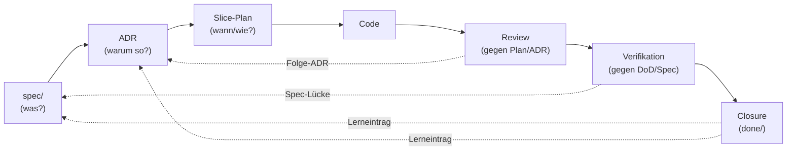

## Modul 1 — Der Entwicklungszyklus

<!-- Quelle: [01-spec-und-architektur/modul-01-entwicklungszyklus.md](https://github.com/pt9912/ai-harness-course/blob/v3.5.0/kurs/de/01-spec-und-architektur/modul-01-entwicklungszyklus.md) -->

### Lebenszyklus als Diagramm

Die durchgezogenen Pfeile sind der *Vorwärtspfad* (was wird gebaut), die
gestrichelten der *Rückwärtspfad* (was lernt der Harness daraus). Beide
Richtungen sind Pflicht — eine Kette ohne Rückverweise ist nicht
auditierbar.

Review prüft Code gegen *Plan und ADR*.
Wenn der Plan die ADR-Verletzung nicht antizipiert hat, sieht Review
sie nicht. Verifikation prüft Code gegen *DoD und Spec* (und dort
referenzierte ADRs). Das ist genau der Grund, warum Review und
Verifikation getrennte Rollen sind — siehe [Modul 8](modul-08-agentenrollen.md).

### Kernidee (Modul 1)

Jedes Artefakt verweist nach oben (Begründung) und nach unten
(Konsequenz). Eine Kette ohne Rückverweise ist nicht auditierbar.

### Regeln gegen typische Fehlannahmen (Modul 1)

- Plan ist die Stelle, an der Spec und ADR auf einen Code-Diff zusammenfallen. Ohne Bezugs-IDs zu Spec/ADR ist der Plan nicht prüfbar (und damit kein Plan, sondern eine Liste).
- Closure verlangt einen Lerneintrag im Slice. Ohne Lerneintrag wird die Welle nicht "fertig", sondern nur "weg".
- Wer das erste Mal ein Konflikt zwischen AGENTS.md und Spec hat und dann erst überlegt, hat den Konflikt bereits in den Code laufen lassen.

### Ziel-Form: Source-Precedence-Block (Modul 1)

**Schritt 0 — Baseline und Modus festlegen** (Eingang in den
Lebenszyklus, *vor* dem Sammeln kanonischer Quellen): welche
Harnesskonvention adoptiert wird (AI-Harness-Kurs, interner Standard,
Industrie-Norm), welche Repo-Klasse gilt (Referenz, Safety/Control,
Policy/Compliance, Tooling) und welcher Modus pro Sub-Area (Greenfield:
Doc führt, Code folgt; Brownfield: Code führt, Doku folgt — mit
Konvergenz-Auftrag zu Greenfield). Die drei Entscheidungen prägen jede
Folge-Aktion: in Brownfield ist der nächste Schritt *Inventur des
Bestands*, in Greenfield *Auflisten zu schaffender Quellen*.
Volldefinition + Phasen-Modell in
[`grundlagen/konventionen.md` §Harness-Bootstrap](grundlagen-konventionen.md#harness-bootstrap)
und im ausgearbeiteten [Modul 2 — Harness-Bootstrap](modul-02-harness-bootstrap.md).

Der Precedence-Block selbst lebt in `harness/README.md` (Vorlage
[`templates/harness/README.template.md`](../templates/harness/README.template.md)).
Operative Regeln für die sechs Folge-Schritte:

- **Zwei Rang-Achsen, beide absteigend:** vertragliche Bindung
  (Lastenheft → Spezifikation → Architektur → ADRs → Roadmap →
  Operativ-Doku → Allgemein-Doku) und Schreib-Frequenz. Reihenfolge nie
  umdrehen — sonst überschreibt die oft geänderte `AGENTS.md` still die
  selten geänderte Spec (genau die Drift, gegen die Source Precedence
  erfunden wurde). `harness/README.md` rangiert selbst *unten*
  (Einstiegspunkt, keine neue Quelle). **Neun Ränge sind ein Maximum** —
  mehr heißt Mehrfach-Repräsentationen, die in die Schichten 1–3 gehören.
- **Konfliktauflösungs-Klausel** neben der Tabelle, spiegelbildlich auch
  im `AGENTS.md`-Header: widerspricht die Datei einer kanonischen Quelle,
  *gewinnt die kanonische Quelle*, und die Datei wird angepasst (bei
  Konflikt → höher rangierende Quelle sticht, niedrigere anpassen; nie
  die ADR an die `AGENTS.md`-Hard-Rule angleichen).
- **Spec-Stratifizierung** als Kurzhinweis im Block: innerhalb der Spec
  gilt Lastenheft (1) → Spezifikation (2) → Architektur (3); eine ADR
  darf die Spezifikation schärfen, nie das Lastenheft (Volldefinition in
  [`grundlagen/konventionen.md`](grundlagen-konventionen.md#source-precedence)).
- Die konkrete Rangordnung ist **projektspezifisch** (Safety/Control-,
  Policy/Compliance-Repos können abweichen); Wahl und Begründung gehören
  in den Adaptions-Block des repo-lokalen Konventionsdokuments.

