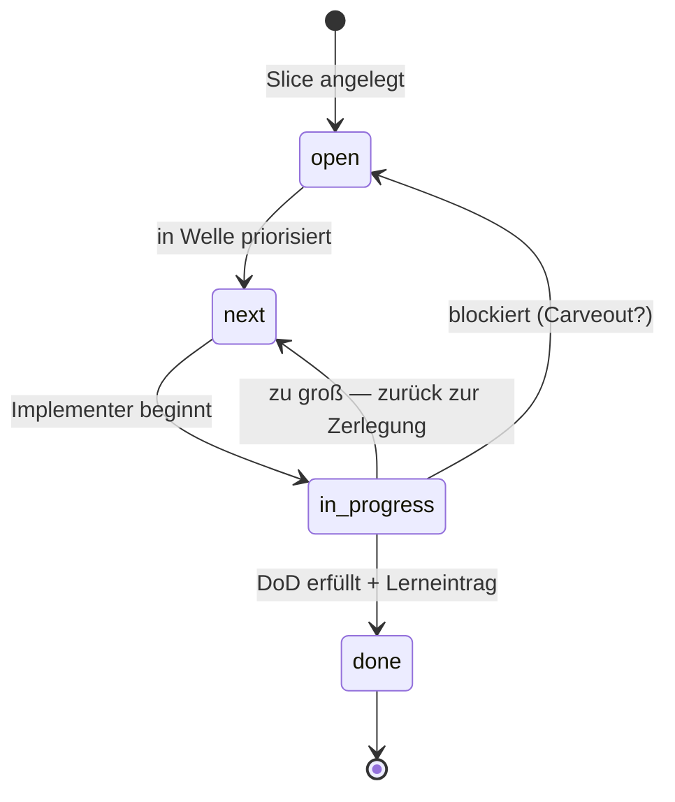

## Modul 5 — Planning Harness

<!-- Quelle: [02-planung/modul-05-planning-harness.md](https://github.com/pt9912/ai-harness-course/blob/v3.5.0/kurs/de/02-planung/modul-05-planning-harness.md) -->

### Kernidee (Modul 5)

Ein Slice ist klein, wenn ein Agent ihn in *einem* Lauf abschließen kann
und ein Reviewer den Diff *in einer Sitzung* prüfen kann. Größer ist
falsch.

### Lifecycle als State Machine

Drei Übergänge sind nichttrivial: `in_progress → next` (Rückführung bei
Größen-Erkenntnis) und `in_progress → open` (Blocker — meist mit
Carveout, siehe [Modul 7](modul-07-carveouts.md)). Der einzige Übergang
nach `done` verlangt *Lerneintrag*, nicht nur "Tests grün".

### Trigger je Lifecycle-Übergang und WIP-Limit (Modul 5)

Alle fünf Übergänge mit Triggerbedingung:

- `open→next` — priorisiert/eingeplant.
- `next→in-progress` — Implementer übernimmt, Abhängigkeiten gelöst, WIP-Limit frei.
- `in-progress→done` — Closure-Kriterien erfüllt.
- `in-progress→next` — Slice zu groß, zurück zum Schneiden.
- `in-progress→open` — Blocker, Priorität offen.

Am leichtesten übersehen werden die *Rückführungen* — `in-progress→next`
und `in-progress→open` —, weil sie wie "Scheitern" aussehen, in Wahrheit
aber die Lifecycle-Disziplin tragen: ein Slice, der zu groß war, gehört
sichtbar zurück, nicht still weitergeschoben.

WIP-Limit pro Implementer = 1 ist eine harte Größe, kein Vorschlag — wer
mehrere Slices gleichzeitig in `in-progress/` hat, hat keine Lifecycle,
sondern ein Buffet.

### Closure- und Lerneintrag-Regeln (Modul 5)

- Übergang nach `done/` verlangt zwei beobachtbare Closure-Kriterien
  (z. B. Replay grün, DoD-Punkte als Test verlinkt) *und* einen
  Lerneintrag in einer der drei Formen (geschärfte Regel · neuer Sensor ·
  benannte Spec-Lücke).
- Der Lerneintrag schließt den Steering Loop — ohne ihn bleibt das
  Versagensmuster unsichtbar und wiederholt sich.
- Ein Slice darf bei rotem Gate nur mit dokumentiertem Carveout
  (Modul 7) in `done/` landen, der den roten Gate-Status auf Trigger
  schaltet. Unterscheidung: Carveout (Ausnahme, mit Folge-Slice) vs.
  bootstrap-aware Gate (Stufung, mit Hochschalt-Trigger, Modul 13). Die
  volle Werkzeug-Triade inkl. *BF-Sub-Area-Markierung* (Sub-Area-Kontext,
  kein Closure-Werkzeug) wird in
  [Modul 7 §Werkzeug-Wahl bei Diskrepanz](modul-07-carveouts.md#werkzeug-wahl)
  disambiguiert.

### Ziel-Form: Slice

Ein Slice-Plan folgt der Vorlage
[`templates/docs/plan/planning/slice.template.md`](../templates/docs/plan/planning/slice.template.md).
Größen- und Schnitt-Regeln:

- **Zu groß**, wenn eines zutrifft: mehr als drei DoD-Punkte · mehrere
  Schichten betroffen (Adapter + Service + UI + DB-Schema) · nicht in
  *einer* Review-Sitzung prüfbar. Dann zurück zum Schneiden
  (`in-progress→next`), nicht still weiterschieben.
- **Schnitt nach Lieferwert, nicht nach Schichten.** Ein Schicht-Schnitt
  (`…-db`, `…-service`, `…-ui`) erzeugt voneinander abhängige, einzeln
  nutzlose Zombie-Slices, die in `in-progress/` festhängen.
- Jeder Schnitt-Slice ist **einzeln lieferbar** (kein Slice wartet auf
  den nächsten), hat **≤ 3 DoD-Punkte** und berührt **höchstens zwei
  Schichten**.

### Ziel-Form: Sub-Area-Modus-Begründung

Der Bootstrap-Modus ist Eigenschaft *pro Sub-Area*, nicht pro Slice; ein
Slice berührt mehrere Sub-Areas und kann GF, BF und Hybrid gleichzeitig
involvieren. Pro berührter Sub-Area vier Pflichtkriterien (vier, nicht
erweitern):

1. **Konventionen-Dichte** — wieviel der berührten Doku-/Code-Sektion ist
   durch `harness/conventions.md` (oder ein gleichwertiges Artefakt) als
   Strukturregel verankert?
2. **Phase-Reife der berührten Artefakt-Sektionen** — Phase 0–5 aus der
   Phase × Modus-Matrix in [Modul 2](modul-02-harness-bootstrap.md#phasen--modus--die-zweidimensionale-reife-matrix).
3. **Evidenz- und Diskrepanz-Risiko** — wie groß ist die Gefahr, dass
   Inventur den Code-Bestand und die Doku-Aussage als divergent
   ausweist? Bei GF meist niedrig (Doc führt — Inventur prüft nur
   Code-Konformität); bei BF/Hybrid das Hauptrisiko, das die
   Reconciliation-Schätzung trägt.
4. **Reconciliation-Aufwand inklusive Graduation-/Folge-Slice-Trigger** —
   wieviel Slice-Aufwand bringt BF/Hybrid mit sich, und welcher Trigger
   (eine der vier Klassen aus
   [`konventionen.md` §Vier Trigger-Klassen](grundlagen-konventionen.md#vier-trigger-klassen)
   — Sync, Promotion, Cross-Reference, Acceptance — oder eine
   Folge-Slice-ID) schaltet die Sub-Area Richtung GF?

Der Begründungsblock pro Sub-Area ist
[**§8** des Slice-Plans](../templates/docs/plan/planning/slice.template.md):
Modus (GF/BF/Hybrid) · Konventionen-Dichte · Phase-Reife · Evidenz-/
Diskrepanz-Risiko · Reconciliation-Aufwand. Ein Block pro berührter
Sub-Area — so läuft die Modus-Entscheidung im Planning-Harness-Slice mit
und wird in der Closure-Notiz prüfbar.

### Regeln gegen typische Fehlannahmen (Modul 5)

- **Gegen "Slice = Ticket = Feature":** Drei verschiedene Granularitäten. Feature ist Spec-Ebene, Slice ist Implementations-Einheit, Ticket ist Projektmanagement. Slice ist die kleinste *agentisch abschließbare* Einheit.
- **Gegen "Erst plan ich alle Slices, dann fange ich an":** Wer alle Slices vor der ersten Implementation plant, plant tote Slices. Plan und Implementation alternieren — Welle für Welle.
- **Gegen "Wenn ein Slice in `done/` ist, ist er fertig":** Ohne Lerneintrag ist er nur *abgelegt*. Closure ist eine bewusste Reflexionsleistung: was hat funktioniert, was war Friktion, was geht in den Steering Loop?
- **Gegen "Ein Slice hat einen Bootstrap-Modus":** Der Modus ist Eigenschaft *pro Sub-Area* ([Modul 2 §Kernidee](modul-02-harness-bootstrap.md#kernidee-modul-2)). Ein Slice berührt mehrere Sub-Areas und kann GF, BF und Hybrid gleichzeitig involvieren.
- **Gegen "Wenn der Slice klein ist, ist die berührte Sub-Area GF":** Transitive Vereinfachung. Slice-Größe und Sub-Area-Modus sind orthogonale Achsen: Slice-Größe misst, ob der Schnitt in einer Review-Sitzung prüfbar ist; Sub-Area-Modus misst den Reifegrad der berührten Doku-/Code-Sektion. Ein kleiner Slice kann eine BF-Sub-Area berühren (Beispiel: Login-Endpoint ist klein, aber das Test-Layout für die Auth-Schicht ist nicht in `harness/conventions.md` verankert).

