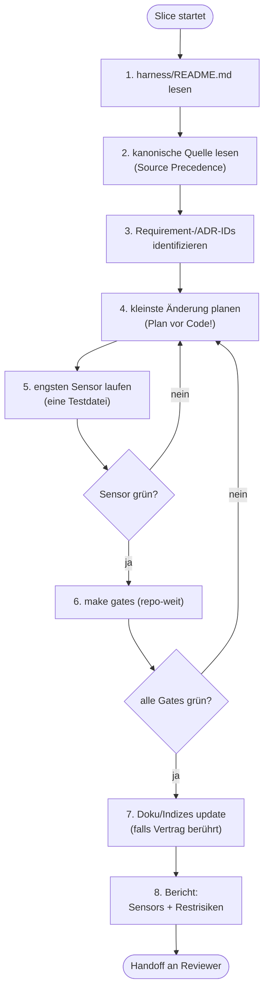

## Modul 9 — Implementierung durch KI-Agenten

<!-- Quelle: [03-agenten/modul-09-implementierung.md](https://github.com/pt9912/ai-harness-course/blob/v3.5.0/kurs/de/03-agenten/modul-09-implementierung.md) -->

### Kernidee (Modul 9)

Ein Agent ohne Plan schreibt Code. Ein Agent mit Plan schreibt das
*Richtige*. Die Reihenfolge Plan → Diff → Code ist nicht optional.

### Minimal Agent Workflow (8 Schritte)

Der Pfad, den jeder Implementation-Agent pro Slice durchläuft — und der
in `harness/README.md` als Vertrag dokumentiert wird. Strukturfragen
(Bindung-Klassen für die Sensors-Tabelle, Source-Precedence-Begründung,
Modus pro Sub-Area, Adaptionen ggü. der adoptierten Baseline) leben
in `harness/conventions.md`:

1. `harness/README.md` lesen.
2. Relevante kanonische Quelle lesen (Source Precedence beachten).
3. Betroffene Requirement-/ADR-IDs identifizieren.
4. Kleinste sinnvolle Änderung planen.
5. Engsten nützlichen Sensor laufen lassen (z. B. nur eine Testdatei).
6. Repo-weiter Gate-Lauf vor Handoff (`make gates`).
7. Doku/Indizes aktualisieren, falls ein öffentlicher Vertrag berührt ist.
8. Ausgeführte Sensors und verbleibende Risiken berichten — keine Erfolgsmeldung ohne Gate-Ausführung.

#### Workflow als Diagramm

Zwei Rücksprungkanten sind wesentlich: 5→4 und 6→4. Nicht
zurück zu Schritt 1 — der Plan wird *verfeinert*, nicht der Kontext neu
gelesen.

### Rücksprungkanten-Regeln (Modul 9)

- **Kein Rücksprung zu Schritt 1**, sondern nur 5→4 (Plan verfeinern)
  und 6→4 (Plan korrigieren wegen Gate). Wer in Schritt 1 zurückspringt,
  hat einen Kontext-Defekt, keinen Plan-Defekt — das ist eine andere
  Ursache und gehört in den nächsten Steering-Loop-Eintrag.
- Roter `arch-check` in Schritt 6 (ADR-Verstoß durch direkten Import):
  Rücksprung zu **Schritt 4** (Plan verfeinern) — der ADR-Verstoß ist
  ein *Plan*-Defekt, nicht ein Kontext-Defekt; der Agent kannte die ADR,
  hat den Diff aber falsch geschnitten. Konkrete Korrektur: z. B.
  Adapter-Wrapper statt direktem Import, sodass die Schichtung gewahrt
  bleibt. Rücksprung zu Schritt 1 wäre nur richtig, wenn der Agent die
  ADR gar nicht *im Kontext* hatte (Kontext-Defekt) — dann fehlt die
  kanonische Quelle, nicht der Plan. Die Wahl der Kante ist die Diagnose
  der Ursache.

### Hard Rules (repo-spezifisch)

Negativregeln, die der Agent nie brechen darf. Eine gute Hard Rule hat
*Falsch/Richtig*-Beispiele **und** eine *technische Begründung*.
Beispiele aus realen Repos (siehe
[`fallstudien.md`](https://github.com/pt9912/ai-harness-course/blob/v3.5.0/kurs/de/grundlagen/fallstudien.md)):

* **Docker-only** (grid-gym): kein lokales `.venv`, kein `pip install` außerhalb von Dockerfile-Stages.
  *Falsch:* `uv run python tools/foo.py`.
  *Richtig:* `docker compose run --rm test-runner uv run python tools/foo.py`.
  *Begründung:* Toolchain-Reproduzierbarkeit + Supply-Chain-Defense.
* **`# noqa` ist verboten** (grid-gym): bricht das `noqa-gate` in `make gates`. Ausnahmen werden in `pyproject.toml` mit Begründung dokumentiert.
* **Suppression-Verbot pro Sprache** — derselbe Mechanismus, andere Syntax:
  * Python: `# noqa` (grid-gym `noqa-gate`)
  * Go: `//nolint`
  * C#: `#pragma warning disable`, `[SuppressMessage]` (bess-ems `solid-suppression-gate`)
  * Kotlin: `@Suppress("...")`
  * Java: `@SuppressWarnings("...")`
  In jeder Sprache gilt: Inline-Suppression bricht das Suppression-Gate; Ausnahmen wandern in eine zentrale Konfigurations-Datei mit Begründung.
* **git mv + Inhaltsänderung = zwei Commits** (grid-gym): erst reiner `git mv` (Git erkennt R-Rename), dann Inhalt umschreiben.
  *Begründung:* Sonst fällt die Rename-Detection unter die 50 %-Similarity-Schwelle und `git log --follow` wird unzuverlässig.
* **Architektur ist sprach- und meilensteinfrei** (grid-gym, c-hsm-doc): `spec/architecture.md` referenziert ADRs und Modul-Pfade, aber keine Wellen, Slices oder Closure-Daten. Die zeitliche Schicht lebt in `docs/plan/planning/`.
* **Optimierer darf nie direkt aufs Gerät schreiben** (bess-ems-Klasse): Output fließt durch Statemachine, Constraint-Limiter, Ramp-Limiter.
* **Gates dürfen nicht ohne ADR gelockert werden**: jede Schwellen-Senkung ist ein ADR, kein PR-Kommentar.

Hard Rules sind *computational + inferential feedforward* zugleich: sie
stehen in AGENTS.md (Agent liest sie) **und** werden idealerweise durch
eine Fitness Function geprüft (Linter schlägt an). Wenn nur eines von
beiden existiert, ist die Regel nur halb durchgesetzt.

### Kontext-Verdichtung (Kehrseite der Lopopolo-Maxime)

Die Maxime *"Was der Agent nicht im Kontext erreicht, existiert für ihn
nicht"* (Original: *"anything it can't access in-context doesn't exist"*)
ist eine Hebellinse — sie erklärt, warum Spec, ADR und AGENTS.md *die
Hauptkontrolle* sind, nicht Beiwerk. Aber sie hat eine Kehrseite, die der
Reflex "mehr Kontext rein" gerne überliest:

- **Kontext-Pollution.** Wenn ein 14 Wochen alter ADR-Entwurf im Kontext
  steht, der mit `superseded` markiert ist, erfindet der Agent
  Begründungen *aus dem alten ADR*. Der Kontext besteht — die
  Information ist falsch. Mehr Tokens, schlechteres Ergebnis.
- **Lost in the Middle.** Auch bei großen Kontext-Fenstern fallen
  Informationen in der Mitte des Prompts deutlich seltener in den
  Output zurück als Anfang und Ende. Wer wichtige Anforderungen
  ungeordnet "dazwischen" platziert, hat sie technisch im Kontext und
  praktisch nicht.
- **Token-Kosten.** Jedes Token im Eingangskontext wird abgerechnet —
  pro Lauf, pro Tool-Call, pro Replay. Ein 30-zeiliger irrelevanter
  Block, der in 1500 PRs mitläuft (siehe Lopopolos empirischer Beleg in
  [`quellen.md`](https://github.com/pt9912/ai-harness-course/blob/v3.5.0/kurs/de/abschluss/quellen.md)), ist eine
  Rechnung mit vier Stellen vor dem Komma.

Folge: Context Engineering ist *auch* eine Reduktions-Aufgabe.
Konkret gehört in den Lauf-Kontext:

| Pflicht | Wer? |
|---|---|
| `harness/README.md` | jeder Lauf |
| relevante kanonische Quelle (Source Precedence) | jeder Lauf, gezielt |
| Requirement-/ADR-IDs des Slice | jeder Lauf |
| AGENTS.md (Hard Rules + Konventionen) | jeder Lauf |
| Tool-Allowlist | jeder Lauf |

| Nicht in den Lauf-Kontext (Anti-Pattern) |
|---|
| `superseded`/`deprecated` ADRs ohne Folge-Bezug |
| historische Spec-Diff-Notizen, die jetzt in ADR-Form gegossen sind |
| Skills, die nicht zu dieser Rolle gehören |
| ältere Carveouts, deren Auflösungs-Trigger bereits eingetreten ist |

Die Verdichtungs-Sensoren dafür sind in [Modul 15](modul-15-observability.md):
Token-Eingabe-Metrik pro Slice, Cache-Hit-Rate (siehe Mini-Glossar in
Modul 15), und der **Doku-Konsistenz-Agent** als Drift-Detektor für tote
Kontext-Stücke.

Faustregel für den 8-Schritt-Workflow: Schritt 2 ist *"kanonische Quelle
lesen"*, nicht *"alles lesen, was im Repo liegt"*. Wenn der Plan in
Schritt 4 nicht ohne Verweis auf einen Kontext-Block auskommt, gehört
dieser Block in den nächsten Lauf — alle anderen nicht.

### AGENTS.md-Regeln (Modul 9)

- AGENTS.md ist die zentrale, maschinell lesbare Konventionsdatei
  (Hard Rules + Konventionen) und gehört in jeden Lauf-Kontext.
- Minimale Eingaben eines Implementation-Agenten gegen Halluzination:
  `harness/README.md` + relevante kanonische Quelle +
  Requirement/ADR-IDs + AGENTS.md + Tool-Allowlist. Fehlende Eingaben
  werden *durch Raten ersetzt*, nicht durch Schweigen.
- Jede Hard Rule liegt in *zwei* Quadranten: inferential feedforward
  (steht in AGENTS.md) + computational feedback (Fitness
  Function/Linter-Gate). Hard Rule nur in einem Quadranten ist halb
  durchgesetzt; nur in AGENTS.md vergisst der Agent sie unter Druck,
  nur als Fitness Function ohne AGENTS.md-Eintrag versteht der Agent
  das *Warum* nicht.
- Fertig ist ein Implementation-Agent bei DoD-erfüllt + Schritt 8
  ausgeführt (Bericht über Sensors + Restrisiken). Kompilierender Code
  ist notwendig, nicht hinreichend. Ohne Schritt-8-Bericht wird jedes
  Risiko in die nächste Rolle (Reviewer/Verifier) verlagert — das
  bricht die Kontext-Trennung der Rollen.

### Regeln gegen typische Fehlannahmen (Modul 9)

- **Gegen "Agent liefert schnell, also ist der Workflow Overhead":** Geschwindigkeit ohne Plan produziert Diffs, die später als Review-Last anfallen. Plan + Diff + Code kostet 20 % länger und spart 50 % Review.
- **Gegen "Hard Rules schreibe ich in AGENTS.md, und das reicht":** Eine Hard Rule, die nur in AGENTS.md steht (inferential feedforward), ist halbgesetzt. Erst mit Fitness Function (computational feedback) ist sie *durchgesetzt*. Beides ist Pflicht.
- **Gegen "Wenn die Tests grün sind, ist der Slice fertig":** Schritt 8 verlangt einen Bericht über *Sensors und verbleibende Risiken*. Grüne Tests sind notwendig, nicht hinreichend.
- **Gegen "Die Pre-completion Checklist ist Bürokratie":** Sie ist der einzige Schritt, der vor Übergabe an Reviewer/Verifier eine *Selbstaussage* erzwingt. Wer keinen Selbst-Check macht, lädt jedes Risiko in die nächste Rolle.
- **Gegen "Mehr Kontext ist immer besser — siehe Lopopolo":** Lopopolos *"Was der Agent nicht im Kontext erreicht, existiert für ihn nicht"* sagt: *fehlender* Kontext schadet. Es sagt **nicht**: *jeder zusätzliche* Kontext nützt. Siehe [§Kontext-Verdichtung](#kontext-verdichtung-kehrseite-der-lopopolo-maxime).
- **Gegen "Ein Agent ist ein besserer/schnellerer Programmierer":** *Geschwindigkeit ohne Plan* erzeugt Review-Last, nicht Lieferung. Faustregel: Plan-vor-Code kostet 20 % mehr Zeit *im Lauf* und spart 50 % Review-Zeit *danach* — gemessen pro Slice, nicht pro Minute. Wer den Agenten als Speed-Tool denkt, mißt am falschen Hebel: nicht Diff-pro-Stunde, sondern Slice-bis-`done/`. Belegt durch Lopopolo (~1 Mio. Zeilen Code in ~1500 PRs über fünf Monate mit *drei* Engineers — Skalierung kommt aus dem Harness, nicht aus dem Modell).
