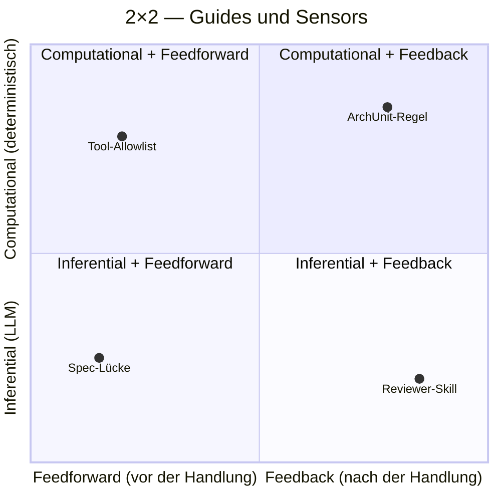
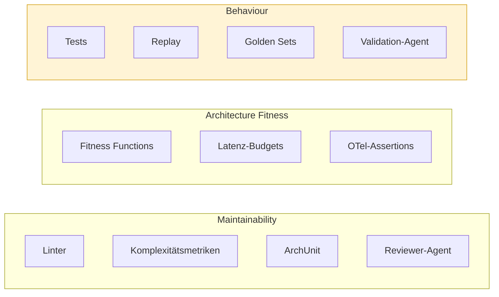
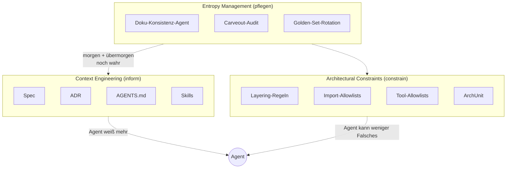
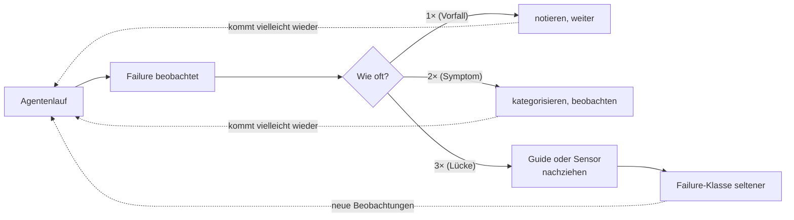
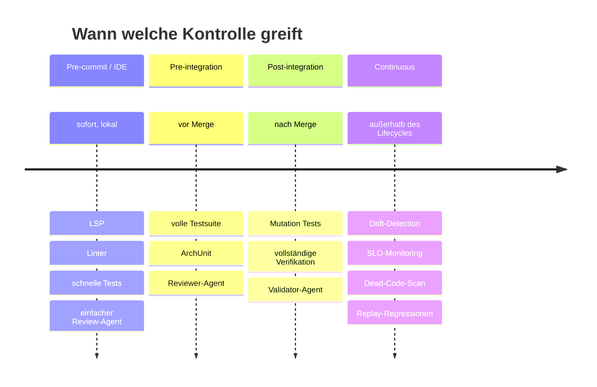

## Klassifikation und Steering Loop
<!-- Quelle: [grundlagen/klassifikation.md](https://github.com/pt9912/ai-harness-course/blob/v3.5.1/kurs/de/grundlagen/klassifikation.md) -->

Wir klassifizieren jede Kontrolle, die der Harness bereitstellt, entlang
mehrerer Achsen. Zwei Schulen prägen das Vokabular: **Böckeler/Thoughtworks**
liefert den konzeptuellen Rahmen, **Lopopolo/OpenAI** das empirische
Playbook (siehe [`fallstudien.md`](https://github.com/pt9912/ai-harness-course/blob/v3.5.1/kurs/de/grundlagen/fallstudien.md) und
[`../abschluss/quellen.md`](https://github.com/pt9912/ai-harness-course/blob/v3.5.1/kurs/de/abschluss/quellen.md)).

### Die 2×2-Matrix (Böckeler) 

|  | **Feedforward** (Guide, präventiv) | **Feedback** (Sensor, detektiv) |
|---|---|---|
| **Computational** (deterministisch) | Typsignaturen, JSON-Schema, Tool-Allowlists, generierte Skeletons | Linter, Typecheck, ArchUnit, Coverage Gate, Schema-Validierung |
| **Inferential** (LLM-gestützt) | Spec, ADR, AGENTS.md, Skills, Beispiel-Korpora | Reviewer-Agent, Verifier-Agent, Validator-Agent, semantischer Diff |

Die Punkte zeigen, wo typische Maßnahmen liegen. Faustregel: **so weit
links und oben wie möglich** — präventive, deterministische Kontrollen
sind die billigsten. Punkte rechts unten (Reviewer-Skill) sind teuer und
sollten erst greifen, was die linken Quadranten nicht abdecken können.

#### Lesart

* *Computational + Feedforward*: macht falsche Aktionen **technisch unmöglich**. Billigste Kontrolle.
* *Computational + Feedback*: erkennt falsche Aktionen **schnell und deterministisch**. Das sind die Gates aus [Modul 13](modul-13-quality-gates.md).
* *Inferential + Feedforward*: gibt dem Agenten Kontext, **bevor** er handelt. Das sind Spec, ADR, Carveouts — die Hebel aus [Modul 3](modul-03-lastenheft.md), [Modul 4](modul-04-architektur-adrs.md), [Modul 7](modul-07-carveouts.md).
* *Inferential + Feedback*: prüft semantisch nach. Das sind Review, Verifikation, Validation — die Hebel aus [Modul 10](modul-10-review-harness.md), [Modul 11](modul-11-verification.md), [Modul 8](modul-08-agentenrollen.md).

Die Faustregel: **so weit links und oben wie möglich**. Eine Regel, die
der Typchecker erzwingt, braucht keinen Reviewer-Agent. Ein ADR, das den
Agenten gar nicht erst in die falsche Richtung schickt, spart das
nachgelagerte Review.

### Sprach-übergreifende Konkretion

Die 2×2-Matrix ist sprach-neutral; die Sensoren in jedem Quadranten
sind es nicht: jede Sprache bringt ihre eigene
Linter/Typecheck/Architekturtest/Coverage-Werkzeugkette (Go, Python,
Kotlin, Java, C#/.NET, C++ …).

### Drei Harness-Kategorien (Böckeler)

Jede Kontrolle adressiert genau eine der drei Kategorien:

| Kategorie | Frage | Typische Werkzeuge | Schwerpunkt-Module |
|---|---|---|---|
| **Maintainability Harness** | Ist der Code lesbar, modular, wartbar? | Linter, Komplexitätsmetriken, ArchUnit, Reviewer-Agent | 10, 13 |
| **Architecture Fitness Harness** | Hält die Lösung Architektur-, Performance- und Observability-Constraints ein? | Fitness Functions, Latenz-Budgets, OTel-Assertions | 4, 11, 15 |
| **Behaviour Harness** | Tut die Lösung das Richtige? | Tests, Replay, Golden Sets, Validation-Agent | 11, 12 |

Die Behaviour-Kategorie (gelb) ist die schwierigste — Böckeler nennt sie
offen die am wenigsten entwickelte. Sie ist der eigentliche Grund, warum
Replay und Golden Sets im Kurs ein eigenes Modul bekommen
([Modul 12](modul-12-replay-evaluierung.md)).

### Drei operative Säulen (OpenAI)

Lopopolo zerlegt die tägliche Harness-Arbeit in drei Säulen, die
orthogonal zu Böckelers Kategorien stehen:

| Säule | Was sie tut | Werkzeuge | Schwerpunkt-Module |
|---|---|---|---|
| **Context Engineering** | dem Agenten das Richtige zur Verfügung stellen | Spec, ADR, AGENTS.md, Skills, dynamisches Verzeichnis-Mapping beim Start | 3, 4, 5 |
| **Architectural Constraints** | dem Agenten das Falsche unmöglich machen | Layering-Regeln, Import-Allowlists, Tool-Allowlists, ArchUnit | 4, 13 |
| **Entropy Management** | den Harness gegen Verfall pflegen | Doku-Konsistenz-Agent, Carveout-Audit, Golden-Set-Rotation | 7, 12, 15 |

Lesart: **Context Engineering** schiebt Information *zum* Agenten;
**Architectural Constraints** ziehen Grenzen *um* den Agenten;
**Entropy Management** pflegt beides, damit es nicht verrottet.

Maxime von Lopopolo: *"Aus Sicht des Agenten existiert alles nicht,
worauf er im Kontext nicht zugreifen kann."* (Original: *"From the
agent's perspective, anything it can't access in-context doesn't
exist."*) — daraus folgt direkt, warum Spec und AGENTS.md kein Beiwerk
sind, sondern die Hauptkontrolle.

**Constrain + Inform** sind die Linsen, durch die Lopopolo die drei
Säulen liest: *Context Engineering* ist primär **inform** (Agent weiß
mehr), *Architectural Constraints* ist primär **constrain** (Agent kann
weniger Falsches), *Entropy Management* sorgt, dass beide auch
übermorgen noch stimmen. Glossar-Eintrag in
[`konventionen.md`](grundlagen-konventionen.md#kernbegriffe).

### Entropy Management

Ein Harness, der nicht aktiv gepflegt wird, verrottet schneller als der
Code, den er schützen soll. Die typischen Verfallsformen:

* **Doku-Drift** — AGENTS.md sagt X, Code macht Y. Lösung: Konsistenz-Agent in CI.
* **Tote Constraints** — ADR-Regel hat keinen Codepfad mehr. Lösung: regelmäßiger Constraint-Scan.
* **Carveout-Wildwuchs** — temporäre Ausnahmen, deren Trigger längst eingetreten ist. Lösung: Carveout-Audit als geplante Welle.
* **Golden-Set-Überfitting** — Replay grün, Realität rot. Lösung: Golden Sets rotieren, neue Beispiele ziehen.

Entropy Management ist nicht ein eigenes Modul, sondern eine Pflicht, die
durch [Modul 7 (Carveouts)](modul-07-carveouts.md),
[Modul 12 (Replay)](modul-12-replay-evaluierung.md)
und [Modul 15 (Observability)](modul-15-observability.md)
verteilt ist.

### Steering Loop

Der Harness ist nicht statisch. Das wiederkehrende Muster:

Wenn dasselbe Versagen zweimal auftritt, ist es ein Symptom; das *dritte*
Mal ist es eine Lücke im Harness. Konkret heißt das:

* Wiederkehrender Spec-Bug → Spec-Template erweitern (Feedforward, inferential)
* Wiederkehrender ADR-Verstoß → ArchUnit-Regel (Feedback, computational)
* Wiederkehrender Tool-Missbrauch → Tool-Allowlist verschärfen (Feedforward, computational)
* Wiederkehrendes Halluzinations-Muster → Reviewer-Skill schreiben (Feedback, inferential)

Der Steering Loop ist die einzige Stelle im Kurs, an der **der Mensch
unersetzbar bleibt**: er entscheidet, wo der Harness wächst.

### Lifecycle-Verteilung

Kontrollen werden über den Lebenszyklus verteilt — je früher und billiger,
desto besser:

| Stufe | Kontrollen | Begründung |
|---|---|---|
| Pre-commit / IDE | LSP, Linter, schnelle Tests, einfacher Review-Agent | billig, sofort |
| Pre-integration | volle Testsuite, ArchUnit, Reviewer-Agent | vor Merge, noch billig genug |
| Post-integration | Mutation Tests, vollständige Verifikation, Validator-Agent | teurer, aber tolerierbar |
| Continuous | Drift-Detection, SLO-Monitoring, Dead-Code, Replay-Regressionen | außerhalb des Change-Lifecycles |

Kosten steigen von links nach rechts. Faustregel: jede Kontrolle, die
zwei Stufen nach links wandern könnte (ohne Schaden), sollte das tun.
Eine Coverage-Prüfung, die erst im "Continuous"-Lauf greift, ist faktisch
keine Coverage-Prüfung — die Information kommt zu spät, um auf den
Slice zurückzuwirken.
