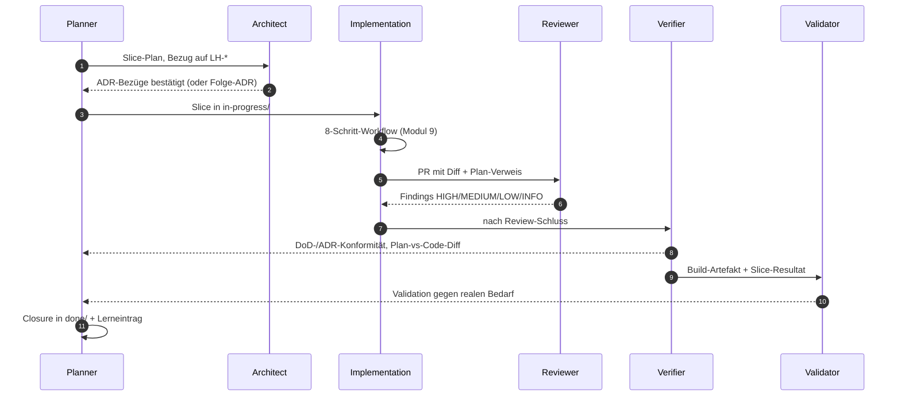

## Modul 8 — Agentenrollen

<!-- Quelle: [03-agenten/modul-08-agentenrollen.md](https://github.com/pt9912/ai-harness-course/blob/v3.5.1/kurs/de/03-agenten/modul-08-agentenrollen.md) -->

### Kernidee (Modul 8)

Rollentrennung verhindert, dass derselbe Kontext zweimal denselben Fehler
macht. Wer geplant hat, prüft nicht; wer geschrieben hat, reviewt nicht.

### Rollen-Sequenz für einen Slice

Wesentlich: keine Rolle springt rückwärts in eine vorhergehende, ohne
*Übergabe-Artefakt* (Findings, Folge-ADR-Vorschlag, Carveout). Der
Eingabe-Kontext jeder Rolle ist eingeschränkt — das verhindert, dass
dieselbe Sicht denselben Fehler übersieht.

### Die neun Übergaben und ihre Artefakte (Modul 8)

Sechs Rollen in der Reihenfolge, in der ein Slice sie typischerweise
durchläuft: Planner → Architect → Implementation → Reviewer → Verifier
→ Validator.

- Planner→Architect: Slice-Plan mit LH-Bezug
- Architect→Planner: ADR-Bezug/Folge-ADR
- Planner→Implementation: Slice in `in-progress/`
- Implementation→Reviewer: PR mit Diff + Plan-Verweis
- Reviewer→Implementation: Findings HIGH/MEDIUM/LOW/INFO
- Implementation→Verifier: DoD-Bestätigung + Sensor-Belege
- Verifier→Planner: DoD-/ADR-Konformitätsbericht + Plan-vs-Code-Diff
- Verifier→Validator: Build-Artefakt + Slice-Resultat
- Validator→Planner: Validierungsbeleg gegen realen Bedarf

Ohne *jedes* dieser Artefakte gibt es keinen Rollenwechsel — nur einen
Kontext-Switch ohne Übergabe. Ein Rollen-Sprung ohne Artefakt ist der
häufigste Pfad zu blinden Flecken.

### Rollen-Regeln (Modul 8)

- Rollen-Trennung ist Kontext-Trennung, nicht Personen-Trennung. Eine
  Person kann mehrere Rollen spielen — aber nicht im selben
  Kontextfenster, sonst wiederholen sich blinde Flecken.
- Verification: "Bauen wir es richtig?" (gegen Plan/DoD); Validation:
  "Bauen wir das Richtige?" (gegen realen Bedarf). Gefährlichster Fall:
  Verifikation grün, Validation rot — Team baut *perfekt das Falsche*.
  Umgekehrter Fall (Verifikation rot, Validation grün) ist
  Prozess-Drift, auch wenn das Ergebnis zufällig passt.
- ADR-Änderung: Architect schreibt; Reviewer prüft auf Konsistenz;
  Implementer liest als Constraint; Accepted-ADRs überschreibt
  *niemand* — Folge-ADR mit `supersedes`. Implementer darf höchstens
  Folge-ADR vorschlagen, niemals stillschweigend einer ADR
  widersprechen. Das wäre Drift, kein "pragmatisches Implementieren".
- Mehrfachzuweisung einer Tätigkeit an zwei Rollen ist *nur dann*
  sauber, wenn jede beteiligte Rolle einen *anderen Eingabe-Kontext*
  hat. Sonst ist es keine Mehrfachzuweisung, sondern doppelte Arbeit
  (und blinde Flecken).

### Konflikt-Pfad als Rollen-Sequenz (Modul 8)

Ein Rollen-Konflikt (Beispiel: Reviewer-HIGH „Verstoß gegen ADR-0001",
Implementer verweist auf eine angebliche Lockerung im Slice-Plan) wird
als **Sequenz mit Übergabe-Artefakten** modelliert — nicht nach
Seniorität („Reviewer klingt senioriger") entschieden. Regeln:

- **Nur die beteiligten Rollen** einbeziehen (hier Reviewer, Implementer,
  Architect, Planner); Verifier/Validator kommen erst nach der Auflösung
  — wer sie früher hineinzieht, lädt deren blinde Flecken in die
  Auflösung.
- **Kein Pfeil ohne benennbares Artefakt.** Wer einen Übergang nicht
  beschriften kann, hat einen blinden Übergang. Das Architect→Reviewer-
  **Verdikt muss ein Artefakt** sein, das der Reviewer in seine
  Skill-Datei übernehmen kann — „mündliche Klärung" ist keine Übergabe,
  sondern Drift mit Kaffeepause.
- **Drei legitime Verdikte** (der vierte — „Reviewer-Finding herabstufen,
  weil Implementer widerspricht" — ist der falsche Pfad, der nur bei
  fehlenden Artefakten existiert):

| Verdikt | Folge-Sequenz | Übergabe-Artefakt |
|---|---|---|
| ADR gilt, Slice-Plan hat falsch behauptet | A → P Plan-Korrektur; P → I neuer Plan; ADR-konforme Neu-Implementierung | Plan-Diff mit Korrektur-Begründung |
| ADR wird per Folge-ADR `supersedes`d | A → R Folge-ADR (`supersedes`); R aktualisiert Skill-Datei | Folge-ADR (Accepted) · Skill-Patch |
| Lockerung legitim, aber undokumentiert | A → P → I Sofort-PR zieht Lockerung als Folge-ADR nach; Slice nicht still abschließen | Folge-ADR + Erinnerungs-Slice in `next/` |

- **Folge-ADR-Hülle vorab bereithalten** (Vorlage
  [`templates/docs/plan/adr/NNNN-titel.template.md`](../templates/docs/plan/adr/NNNN-titel.template.md)),
  damit Verdikt 2 nicht die aufwändigste — und deshalb ungewählte —
  Option ist.
- **Wann *nicht* modellieren:** bei isolierten LOW/INFO-Findings ist die
  Sequenz Overkill (Implementer akzeptiert oder begründet). Sie greift ab
  **HIGH mit Rollen-Widerspruch** oder ab dem **dritten** gleichen
  Konflikttyp — dann wird sie Pflicht im 8-Schritt-Workflow
  ([Modul 9](modul-09-implementierung.md#minimal-agent-workflow-8-schritte)),
  ein Steering-Loop-Signal (siehe
  [`reflexion-vorlage.md`](https://github.com/pt9912/ai-harness-course/blob/v3.5.1/kurs/de/grundlagen/reflexion-vorlage.md#wann-darf-eine-reflexion-nicht-zu-einer-harness-änderung-führen)).

### Regeln gegen typische Fehlannahmen (Modul 8)

- **Gegen "Eine Person spielt alle Rollen":** Geht — *aber mit unterschiedlichem Eingabe-Kontext und unterschiedlichen Skill-Dateien*. Sonst wiederholen sich die blinden Flecken. Rollen-Trennung ist Kontext-Trennung, nicht Personen-Trennung.
- **Gegen "Reviewer macht das Verification gleich mit":** Reviewer prüft gegen Plan/ADR (Maintainability). Verification prüft gegen DoD/Spec (Behaviour/Architecture Fitness). Zwei Fragen, zwei Antworten.
- **Gegen "Validation machen wir vor Release":** Zu spät. Validation gehört *vor* die Implementation größerer Wellen (Spec-Validierung beim Kunden) und nach jedem MVP-Slice.
- **Gegen "Architect entscheidet, Implementation widerspricht nicht":** Implementation darf Folge-ADRs vorschlagen. Was sie *nicht* darf: stillschweigend einer ADR widersprechen.

