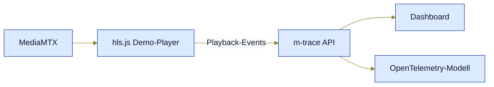
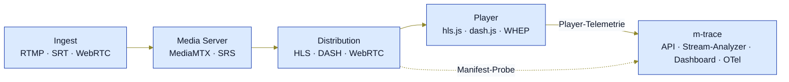

# m-trace

**OpenTelemetry-native Observability für Live-Media-Streaming.**

m-trace ist ein selbst-gehosteter Observability- und Diagnose-Stack für Live-Media-Workflows.  
Er hilft, Media-Streams von der Ingest-Seite bis zum Player nachzuverfolgen, indem er Player-Telemetrie, Stream-Sessions, Infrastruktursignale, Prometheus-Metriken und ein OpenTelemetry-kompatibles Eventmodell zusammenführt.

Aktueller Lieferstand pro Release: [`CHANGELOG.md`](CHANGELOG.md). Aktive Phase und nächste Schritte: [`docs/planning/in-progress/roadmap.md`](docs/planning/in-progress/roadmap.md).

---

## Was ist m-trace?

m-trace richtet sich an Entwickler, Selbsthoster, kleine Streaming-Plattformen, Broadcaster und technische Teams, die verstehen wollen, was in ihrer Streaming-Pipeline passiert — ohne sich von einem proprietären SaaS-Analytics-Silo abhängig zu machen.

### Das erste Ziel
ist einfach — ein lokales Lab, in dem ein Live-HLS-Stream in einem Demo-Player läuft und seine Telemetrie sauber in API, Dashboard und OpenTelemetry-Modell landet:



- **MediaMTX** — liefert ein lokales HLS-Manifest (FFmpeg-Teststream als Quelle).
- **hls.js Demo-Player** — `/demo`-Route im Dashboard, spielt das Manifest und sendet Player-Events.
- **m-trace API** — nimmt Playback-Events an, persistiert Sessions (SQLite per Default).
- **Dashboard** — zeigt Sessions, Events und Session-Timeline.
- **OpenTelemetry-Modell** — Aggregat-Metriken in Prometheus, optional Traces über den OTel-Collector.

### Das langfristige Ziel 
ist breiter — Media-Streams Schicht für Schicht von Ingest bis Player nachverfolgen:



- **Ingest** — RTMP, SRT, WebRTC (WHIP).
- **Media Server** — MediaMTX, SRS.
- **Distribution** — HLS, DASH, WebRTC (WHEP).
- **Player** — hls.js, dash.js, native WHEP-Adapter.
- **m-trace** — API + Stream-Analyzer + Dashboard, OpenTelemetry-kompatibel; korreliert Player-Telemetrie und Manifest-Proben in einer Session-Sicht.

---

## Warum m-trace?

Kommerzielle Plattformen wie Mux Data, Bitmovin Analytics, NPAW/YOUBORA und Conviva lösen viele klassische QoE- und Analytics-Probleme.  
m-trace fokussiert eine andere Lücke:

- selbstgehostete Streaming-Observability
- OpenTelemetry-natives Modellieren
- Korrelation von Ingest bis Player
- entwicklerfreundliche lokale Demos
- Streaming-Diagnose statt Business-Analytics
- praktisches Tooling für kleine Teams und Labs

Das Projekt versucht nicht, eine vollständige kommerzielle Video-Analytics-Plattform zu ersetzen.  
Es soll ein praxistauglicher Open-Source-Stack für technische Streaming-Diagnose werden.

---

## Kerngedanke

Ein typischer Live-Streaming-Flow sieht so aus:

```text
Encoder / FFmpeg / OBS
        ↓
Ingest
        ↓
MediaMTX
        ↓
HLS
        ↓
hls.js Player
        ↓
m-trace Player SDK
        ↓
m-trace API
        ↓
Dashboard / Metrics / OpenTelemetry
```

m-trace sammelt und normalisiert Signale aus Player und Backend, sodass Stream-Sessions inspiziert, debugged und langfristig mit Infrastruktur-Telemetrie korreliert werden können.

---

## Lieferstand und Roadmap

- **Aktueller Lieferstand pro Release**: [`CHANGELOG.md`](CHANGELOG.md).
- **Aktive Phase und nächste Schritte**: Sektion „Roadmap" weiter
  unten plus [`docs/planning/in-progress/`](docs/planning/in-progress/).
- **Was m-trace bewusst nicht ist**: Sektion „Was m-trace nicht ist"
  weiter unten.

---

## Architekturprinzipien

Die aktuelle Architektur ist in [spec/architecture.md](spec/architecture.md) beschrieben.

---

## Eventmodell

Player-Events nutzen ein versioniertes Wire-Format.

Beispiel:

```json
{
  "schema_version": "1.0",
  "events": [
    {
      "event_name": "rebuffer_started",
      "project_id": "demo",
      "session_id": "01J...",
      "client_timestamp": "2026-04-28T12:00:00.000Z",
      "sequence_number": 42,
      "sdk": {
        "name": "@npm9912/player-sdk",
        "version": "0.2.0"
      }
    }
  ]
}
```

Wichtige Konzepte:

- `schema_version`
- `project_id`
- `session_id`
- `client_timestamp`
- `server_received_at`
- `sequence_number`
- SDK-Name und -Version

Das Backend muss Schema-Evolution, Time Skew, Rate Limits und ungültige Event-Batches explizit behandeln.

---

## Metriken

Prometheus wird ausschließlich für Aggregat-Metriken genutzt. Die
drei Backends teilen die Verantwortung wie folgt (kanonische 3-Spalten-
Tabelle: [`spec/telemetry-model.md`](spec/telemetry-model.md) §3.3):

| Backend               | Rolle                                                                                | Cardinality                                                                                                 |
| --------------------- | ------------------------------------------------------------------------------------ | ----------------------------------------------------------------------------------------------------------- |
| **Prometheus**        | Aggregat-Metriken (Counter, Rates)                                                   | bounded — Forbidden-Liste aus [`spec/telemetry-model.md`](spec/telemetry-model.md) §3.1 release-blockierend |
| **SQLite** (ADR-0002) | Per-Session-Historie inkl. `session_id`, `correlation_id`, `trace_id`, redacted URLs | unbeschränkt                                                                                                |
| **OTel/Tempo**        | Per-Request-Trace-Spans (sample-basiert)                                             | nicht im Cardinality-Vertrag                                                                                |

Beispiele für Prometheus-Counter (alle label-frei):

```text
mtrace_playback_events_total
mtrace_invalid_events_total
mtrace_rate_limited_events_total
mtrace_dropped_events_total
mtrace_active_sessions
mtrace_api_batches_received
```

Hochkardinale Werte wie `session_id`, `correlation_id`, `trace_id`,
`user_agent`, `segment_url`, `client_ip` oder Token-/Credential-Felder
dürfen **nicht** als Prometheus-Labels verwendet werden — die
vollständige Forbidden-Liste plus Suffix-Regeln (`*_url`, `*_uri`,
`*_token`, `*_secret`) steht in
[`spec/telemetry-model.md`](spec/telemetry-model.md) §3.1.

Per-Session-Debugging läuft über die durable SQLite-Persistenz und
optional über Tempo-Spans (`make dev-tempo`) — niemals über Prometheus.

---

## OpenTelemetry-Strategie

m-trace ist von Beginn an OpenTelemetry-nativ.

Das bedeutet:

- bestehende OTel-Semantic-Conventions nutzen, wo möglich
- media-spezifische Attribute nur dort definieren, wo nötig
- vendor-spezifische Telemetrieformate vermeiden
- Session-Daten trace-kompatibel halten
- Prometheus auf Aggregate beschränken
- spätere Korrelation über Ingest, Origin und Player vorbereiten

Ein zukünftiger Player-Session-Trace könnte so aussehen:

```text
Player Session Trace
├── manifest_request
├── segment_request
├── startup_time
├── bitrate_switch
├── rebuffer_event
└── playback_error
```

---

## Lokale Entwicklung

Das lokale Core-Lab startet Backend-API, Dashboard, MediaMTX und einen FFmpeg-Teststream:

```bash
git clone https://github.com/pt9912/m-trace.git
cd m-trace
cp .env.example .env   # optional, Default-Lab-Werte sind bereits in docker-compose.yml gesetzt
make dev
```

Smoke-Test:

```bash
make smoke
```

SDK- und Demo-Dokumentation:

- [spec/player-sdk.md](spec/player-sdk.md) beschreibt Installation, Public API, Transport, Performance-Budget und Browser-Build.
- [docs/user/demo-integration.md](docs/user/demo-integration.md) beschreibt die Dashboard-Route `/demo` als lokale hls.js-/Player-SDK-Integration.
- [spec/browser-support.md](spec/browser-support.md) dokumentiert die Browser-Support-Matrix.

Lokaler SDK-/Demo-Pfad:

```bash
make sdk-pack-smoke
make dev
# dann http://localhost:5173/demo?session_id=readme-demo&autostart=1 öffnen
```

Optionaler Observability-Stack mit Prometheus, Grafana und OTel-Collector:

```bash
make dev-observability
make smoke-observability
```

Browser-End-to-End-Test im Playwright-Container:

```bash
make browser-e2e
```

- Dashboard: <http://localhost:5173>
- API: <http://localhost:8080/api/health>
- HLS-Teststream: <http://localhost:8888/teststream/index.m3u8>
- Prometheus: <http://localhost:9090> (`make dev-observability`)
- Grafana: <http://localhost:3000> (`admin`/`admin`, `make dev-observability`)
- OTel Collector: OTLP `localhost:4317`/`4318`, Health <http://localhost:13133>

Details stehen in [docs/user/local-development.md](docs/user/local-development.md).

## Roadmap

Status pro Release, aktive Phase, nächste Schritte und Folge-ADRs
stehen kanonisch in
[`docs/planning/in-progress/roadmap.md`](docs/planning/in-progress/roadmap.md).
Pro-Release-Lieferstand mit Bullet-Listen siehe
[`CHANGELOG.md`](CHANGELOG.md).

---

## Browser-Support

Der MVP-Browser-Support ist bewusst eng gefasst.

| Umgebung                         | MVP-Status                |
| -------------------------------- | ------------------------- |
| Chrome Desktop, aktuelle Stable  | unterstützt               |
| Firefox Desktop, aktuelle Stable | unterstützt               |
| Safari Desktop, aktuelle Stable  | eingeschränkt             |
| Chromium-basierte Browser        | best effort               |
| iOS Safari                       | im MVP nicht erforderlich |
| Android Chrome                   | im MVP nicht erforderlich |
| Smart-TV-Browser                 | nicht im Scope            |
| Embedded WebViews                | nicht im Scope            |

Der MVP-Integrationspfad ist hls.js.  
Native Safari-HLS-Introspektion ist kein Ziel von v0.1.0.

---

## Sicherheit und Datenschutz

m-trace soll für selbstgehostete Umgebungen standardmäßig sicher sein.

MVP-Prinzipien:

- keine Secrets im Repository
- keine cookie-basierte Telemetrie-Annahme
- SDK-Requests nutzen standardmäßig `credentials: "omit"`
- erlaubte Origins werden pro Projekt konfiguriert
- Project-Tokens gelten als niedrig-kritische Browser-Tokens
- Rate Limits sind verpflichtend
- IP-Adressen sollen nicht unnötig gespeichert werden
- User-Agent-Daten sollen reduzierbar oder anonymisierbar sein
- GDPR-konformer Betrieb muss möglich sein

---

## Was m-trace nicht ist

m-trace ist nicht:

- ein Ersatz für kommerzielle QoE-/Werbe-/DRM-Analytics oder einen
  CDN-Optimizer
- eine Multi-Tenant-SaaS-Plattform oder ein Production-Ready-K8s-
  Deployment
- ein Ersatz für MediaMTX, FFmpeg, Grafana, Prometheus oder
  Production-Storage-Backends wie Mimir/ClickHouse
- eine produktive Stream-Control-Plane (der `/api/ingest/...`-Pfad
  ist ein lokaler Lab-Workflow; siehe
  [`docs/user/ingest-control.md`](docs/user/ingest-control.md) §5)

m-trace ist ein technisches Observability- und Diagnose-Projekt für Media-Streaming-Workflows.

---

## Mitarbeit und Sicherheitsmeldungen

- [`CONTRIBUTING.md`](CONTRIBUTING.md) — lokales Setup, Build/Test
  über `make`, Commit- und Release-Konventionen, Erwartung an
  Issues/PRs.
- [`SECURITY.md`](SECURITY.md) — unterstützte Versionen,
  vertraulicher Meldeweg für Sicherheitslücken, Disclosure-
  Verfahren.
- [`.env.example`](.env.example) — dokumentierte, nicht geheime
  Beispielwerte für API, Analyzer, Dashboard und Observability.
- [`deploy/README.md`](deploy/README.md) — Status der
  Deployment-Artefakte (Compose-Lab bleibt der unterstützte
  lokale Pfad; Kubernetes ist Folge-Scope).

---

## Aktueller Stand

Aktuelle Version, Lieferstand pro Release und Folge-Punkte stehen
in den dafür vorgesehenen Single-Source-Dokumenten:

- [`CHANGELOG.md`](CHANGELOG.md) — Keep-a-Changelog-Lieferstand
  pro Release-Tag (Added/Changed/Security/Removed).
- [`docs/planning/in-progress/roadmap.md`](docs/planning/in-progress/roadmap.md)
  — aktive Phase, nächste Schritte und Folge-ADRs.
- [`docs/planning/in-progress/risks-backlog.md`](docs/planning/in-progress/risks-backlog.md)
  — aktive Risiken inklusive Triggerschwellen.

Leitende Dokumente:

- [spec/lastenheft.md](spec/lastenheft.md) — Anforderungen (verbindlich, 1.1.15)
- [docs/planning/in-progress/roadmap.md](docs/planning/in-progress/roadmap.md) — Status, Folge-ADRs, offene Entscheidungen
- [docs/adr/0001-backend-stack.md](docs/adr/0001-backend-stack.md) — Backend-Entscheidung (Accepted: Go)
- [docs/user/releasing.md](docs/user/releasing.md) — Release-Prozess
- [docs/user/quality.md](docs/user/quality.md) — Qualitätsrichtlinien

Nächste Schritte stehen in [docs/planning/in-progress/roadmap.md](docs/planning/in-progress/roadmap.md) §2.

---

## Lizenz

[MIT License](LICENSE).

---

## Name

`m-trace` steht für:

```text
Media Trace
```

Das Projektziel ist simpel:

```text
Media-Streams von Ingest bis Player nachverfolgen.
```
