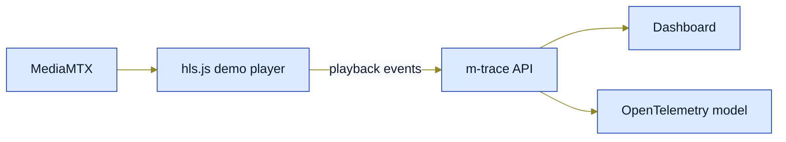
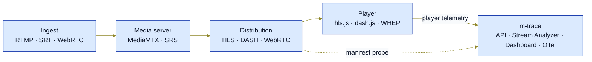

# m-trace

**English** · [Deutsch](README.de.md)

**OpenTelemetry-native observability for live media streaming.**

m-trace is a self-hosted observability and diagnostics stack for live-media workflows.
It helps trace media streams from ingest all the way to the player by correlating
player telemetry, stream sessions, infrastructure signals, Prometheus metrics, and an
OpenTelemetry-compatible event model.

Per-release delivery state: [`CHANGELOG.md`](CHANGELOG.md). Current phase and next
steps: [`docs/planning/in-progress/roadmap.md`](docs/planning/in-progress/roadmap.md).

---

## What is m-trace?

m-trace is a **self-hosted observability and diagnostics stack for media-streaming
pipelines**. Player telemetry, manifest analyses, and SRT health data land in a
consistent session model (API + dashboard) and an OpenTelemetry aggregate
(Prometheus, optionally traces via the OTel Collector). Persistence defaults to
SQLite; the entire stack runs as a Compose lab on a developer laptop.

The focus is **cross-layer streaming correlation** — from ingest (RTMP/SRT/WebRTC)
through media servers (MediaMTX, SRS) and distribution (HLS/DASH/WebRTC) to the
player (hls.js, dash.js, native WHEP adapter). Player events, manifest probes,
and optional SRT connection stats can be compared side by side within a single
session view, without a central proprietary vendor in the middle.

The architecture is **hexagonal** (`apps/api` as a Go backend with typed
driving/driven ports, SvelteKit dashboard, publishable TypeScript player SDK,
stream-analyzer library and CLI). Operational requirements (build, test,
coverage, lint, drift checks, SDK pack smokes) run reproducibly in a container
via `make gates`.

The target audience is developers, self-hosters, small streaming platforms,
broadcasters, and technical teams who want to understand what is happening in
their pipeline — without locking themselves into a proprietary SaaS analytics
silo.

### The first goal
is simple — a local lab in which a live HLS stream plays in a demo player and its
telemetry lands cleanly in API, dashboard, and OpenTelemetry model:



- **MediaMTX** — serves a local HLS manifest (FFmpeg test stream as the source).
- **hls.js demo player** — the dashboard's `/demo` route plays the manifest and emits player events.
- **m-trace API** — ingests playback events and persists sessions (SQLite by default).
- **Dashboard** — displays sessions, events, and a session timeline.
- **OpenTelemetry model** — aggregate metrics in Prometheus, optionally traces via the OTel Collector.

### The long-term goal
is broader — track media streams layer by layer from ingest to player:



- **Ingest** — RTMP, SRT, WebRTC (WHIP).
- **Media server** — MediaMTX, SRS.
- **Distribution** — HLS, DASH, WebRTC (WHEP).
- **Player** — hls.js, dash.js, native WHEP adapter.
- **m-trace** — API + Stream Analyzer + Dashboard, OpenTelemetry-compatible; correlates player telemetry and manifest probes in a single session view.

---

## Why m-trace?

Commercial platforms such as Mux Data, Bitmovin Analytics, NPAW/YOUBORA, and
Conviva solve many of the classic QoE and analytics problems.
m-trace targets a different gap:

- self-hosted streaming observability
- OpenTelemetry-native modelling
- correlation from ingest to player
- developer-friendly local demos
- streaming diagnostics rather than business analytics
- pragmatic tooling for small teams and labs

The project is **not** trying to replace a full commercial video-analytics
platform. It aims to become a practical open-source stack for technical
streaming diagnostics.

---

## Core idea

A typical live-streaming flow looks like this:

```text
Encoder / FFmpeg / OBS
        ↓
Ingest
        ↓
MediaMTX
        ↓
HLS
        ↓
hls.js player
        ↓
m-trace player SDK
        ↓
m-trace API
        ↓
Dashboard / Metrics / OpenTelemetry
```

m-trace collects and normalises signals from the player and the backend so that
stream sessions can be inspected, debugged, and — long-term — correlated with
infrastructure telemetry.

---

## Delivery state and roadmap

- **Per-release delivery state**: [`CHANGELOG.md`](CHANGELOG.md).
- **Current phase and next steps**: the "Roadmap" section below plus
  [`docs/planning/in-progress/`](docs/planning/in-progress/).

---

## Architecture principles

The current architecture is described in
[spec/architecture.md](spec/architecture.md).

---

## Event model

Player events use a versioned wire format.

Example:

```json
{
  "schema_version": "1.0",
  "events": [
    {
      "event_name": "rebuffer_started",
      "project_id": "demo",
      "session_id": "01J...",
      "client_timestamp": "2026-04-28T12:00:00.000Z",
      "sequence_number": 42,
      "sdk": {
        "name": "@pt9912/player-sdk",
        "version": "0.2.0"
      }
    }
  ]
}
```

Key concepts:

- `schema_version`
- `project_id`
- `session_id`
- `client_timestamp`
- `server_received_at`
- `sequence_number`
- SDK name and version

The backend must explicitly handle schema evolution, time skew, rate limits,
and invalid event batches.

---

## Metrics

Prometheus is used exclusively for aggregate metrics. The three backends share
the responsibility as follows (canonical 3-column table:
[`spec/telemetry-model.md`](spec/telemetry-model.md) §3.3):

| Backend               | Role                                                                                | Cardinality                                                                                                  |
| --------------------- | ----------------------------------------------------------------------------------- | ------------------------------------------------------------------------------------------------------------ |
| **Prometheus**        | Aggregate metrics (counters, rates)                                                 | bounded — forbidden list in [`spec/telemetry-model.md`](spec/telemetry-model.md) §3.1 is release-blocking    |
| **SQLite** (ADR-0002) | Per-session history incl. `session_id`, `correlation_id`, `trace_id`, redacted URLs | unbounded                                                                                                    |
| **OTel/Tempo**        | Per-request trace spans (sample-based)                                              | not part of the cardinality contract                                                                         |

Examples of Prometheus counters (all label-free):

```text
mtrace_playback_events_total
mtrace_invalid_events_total
mtrace_rate_limited_events_total
mtrace_dropped_events_total
mtrace_active_sessions
mtrace_api_batches_received
```

High-cardinality values such as `session_id`, `correlation_id`, `trace_id`,
`user_agent`, `segment_url`, `client_ip`, or token/credential fields **must
not** be used as Prometheus labels — the full forbidden list plus suffix rules
(`*_url`, `*_uri`, `*_token`, `*_secret`) lives in
[`spec/telemetry-model.md`](spec/telemetry-model.md) §3.1.

Per-session debugging runs over the durable SQLite persistence and optionally
over Tempo spans (`make dev-tempo`) — never via Prometheus.

---

## OpenTelemetry strategy

m-trace is OpenTelemetry-native from day one.

That means:

- reuse existing OTel semantic conventions wherever possible
- define media-specific attributes only where needed
- avoid vendor-specific telemetry formats
- keep session data trace-compatible
- restrict Prometheus to aggregates
- prepare for later correlation across ingest, origin, and player

A future player-session trace might look like:

```text
Player session trace
├── manifest_request
├── segment_request
├── startup_time
├── bitrate_switch
├── rebuffer_event
└── playback_error
```

---

## Local development

The local core lab starts backend API, dashboard, MediaMTX, and an FFmpeg test
stream:

```bash
git clone https://github.com/pt9912/m-trace.git
cd m-trace
cp .env.example .env   # optional, default lab values are already set in docker-compose.yml
make dev
```

Smoke test:

```bash
make smoke
```

SDK and demo documentation:

- [spec/player-sdk.md](spec/player-sdk.md) describes installation, public API, transport, performance budget, and browser build.
- [docs/user/demo-integration.md](docs/user/demo-integration.md) describes the dashboard `/demo` route as a local hls.js / player-SDK integration.
- [spec/browser-support.md](spec/browser-support.md) documents the browser support matrix.

Local SDK / demo path:

```bash
make sdk-pack-smoke
make dev
# then open http://localhost:5173/demo?session_id=readme-demo&autostart=1
```

Optional observability stack with Prometheus, Grafana, and OTel Collector:

```bash
make dev-observability
make smoke-observability
```

Browser end-to-end test in the Playwright container:

```bash
make browser-e2e
```

- Dashboard: <http://localhost:5173>
- API: <http://localhost:8080/api/health>
- HLS test stream: <http://localhost:8888/teststream/index.m3u8>
- Prometheus: <http://localhost:9090> (`make dev-observability`)
- Grafana: <http://localhost:3000> (`admin`/`admin`, `make dev-observability`)
- OTel Collector: OTLP `localhost:4317`/`4318`, health <http://localhost:13133>

Details live in [docs/user/local-development.md](docs/user/local-development.md).

## Roadmap

Per-release status, current phase, next steps, and follow-up ADRs live
canonically in
[`docs/planning/in-progress/roadmap.md`](docs/planning/in-progress/roadmap.md).
Per-release delivery state with bullet lists lives in
[`CHANGELOG.md`](CHANGELOG.md).

---

## Browser support

MVP browser support is intentionally narrow.

| Environment                       | MVP status               |
| --------------------------------- | ------------------------ |
| Chrome desktop, current stable    | supported                |
| Firefox desktop, current stable   | supported                |
| Safari desktop, current stable    | limited                  |
| Chromium-based browsers           | best effort              |
| iOS Safari                        | not required for the MVP |
| Android Chrome                    | not required for the MVP |
| Smart-TV browsers                 | out of scope             |
| Embedded WebViews                 | out of scope             |

The MVP integration path is hls.js.
Native Safari HLS introspection is not a goal of v0.1.0.

---

## Security and privacy

m-trace aims to be safe by default in self-hosted environments.

MVP principles:

- no secrets in the repository
- no cookie-based telemetry acceptance
- SDK requests default to `credentials: "omit"`
- allowed origins are configured per project
- project tokens are treated as low-trust browser tokens
- rate limits are mandatory
- IP addresses must not be stored unnecessarily
- user-agent data must be reducible or anonymisable
- GDPR-compliant operation must be possible

---

## Contributing and security reports

- [`CONTRIBUTING.md`](CONTRIBUTING.md) — local setup, build/test via `make`,
  commit and release conventions, expectations for issues and PRs.
- [`SECURITY.md`](SECURITY.md) — supported versions, confidential reporting
  channel for security issues, disclosure process.
- [`.env.example`](.env.example) — documented, non-secret example values for
  API, analyzer, dashboard, and observability.
- [`deploy/README.md`](deploy/README.md) — status of the deployment artifacts
  (the Compose lab stays the supported local path; Kubernetes is follow-up
  scope).

---

## Current state

Current version, per-release delivery state, and follow-up items live in the
designated single-source documents:

- [`CHANGELOG.md`](CHANGELOG.md) — Keep-a-Changelog delivery state per release
  tag (Added/Changed/Security/Removed).
- [`docs/planning/in-progress/roadmap.md`](docs/planning/in-progress/roadmap.md)
  — current phase, next steps, and follow-up ADRs.
- [`docs/planning/in-progress/risks-backlog.md`](docs/planning/in-progress/risks-backlog.md)
  — active risks with trigger thresholds.

Guiding documents:

- [spec/lastenheft.md](spec/lastenheft.md) — requirements (normative, 1.1.15; German)
- [docs/planning/in-progress/roadmap.md](docs/planning/in-progress/roadmap.md) — status, follow-up ADRs, open decisions
- [docs/adr/0001-backend-stack.md](docs/adr/0001-backend-stack.md) — backend decision (Accepted: Go)
- [docs/user/releasing.md](docs/user/releasing.md) — release process
- [docs/user/quality.md](docs/user/quality.md) — quality guidelines

Next steps live in [docs/planning/in-progress/roadmap.md](docs/planning/in-progress/roadmap.md) §2.

> Project documentation under `spec/` and `docs/` is primarily German; this
> README is the canonical English entry point. The German overview lives in
> [`README.de.md`](README.de.md).

---

## License

[MIT License](LICENSE).

---

## Name

`m-trace` stands for:

```text
Media Trace
```

The project goal is simple:

```text
Trace media streams from ingest to player.
```
