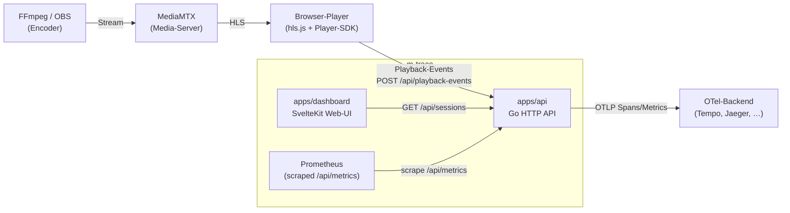
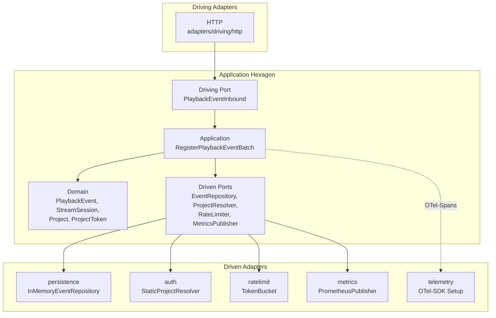
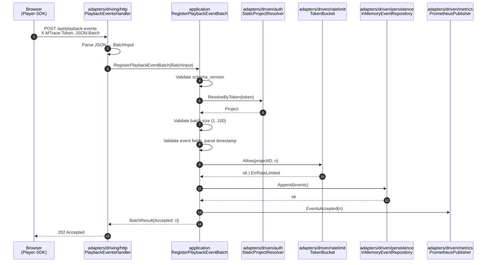
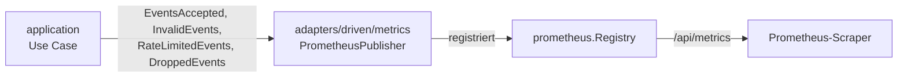
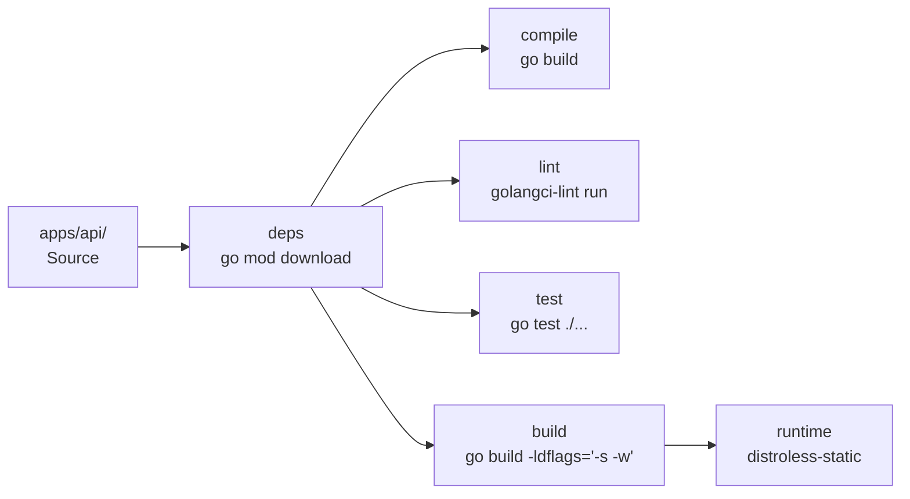
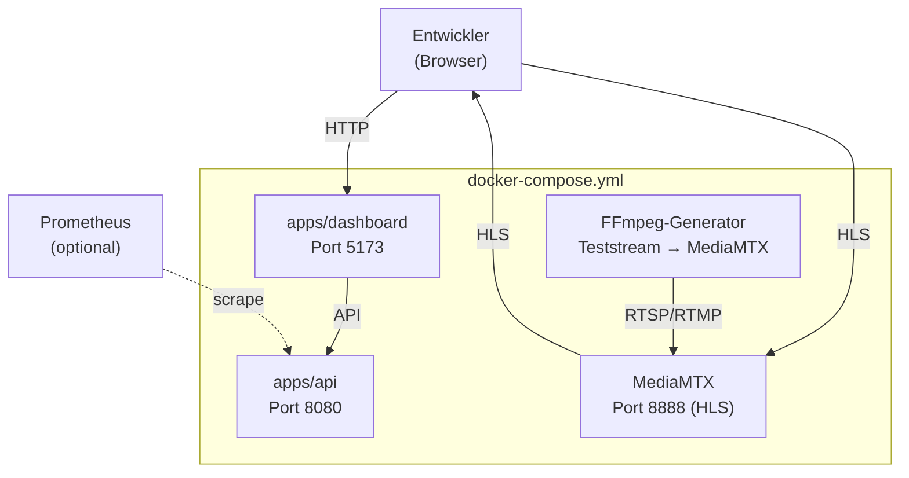

# Architektur — m-trace

## 0. Dokumenteninformationen

| Feld | Wert |
|---|---|
| Dokument | Architektur `m-trace` |
| Stand | `2026-04-29` |
| Status | Pre-MVP `0.1.0` |
| Bezug | [Lastenheft `1.0.0`](./lastenheft.md), [ADR-0001](./adr/0001-backend-stack.md), [Plan-Spike](./plan-spike.md), [Roadmap](./roadmap.md), [Risiken-Backlog](./risks-backlog.md) |

### 0.1 Zweck

Dieses Dokument beschreibt, *wie* die Anforderungen aus dem Lastenheft architektonisch umgesetzt werden. Es führt das Lastenheft nicht erneut, sondern erklärt die strukturellen Entscheidungen, die das Lastenheft an Implementierung knüpft: Hexagon-Aufteilung, Verzeichnisstruktur, Abhängigkeitsregeln, Datenflüsse und die Querverweise zu den Architektur-Entscheidungen (ADRs).

### 0.2 Nicht-Ziel

- Anforderungen formulieren — das ist Aufgabe von [`lastenheft.md`](./lastenheft.md).
- Release-Plan oder Status verfolgen — siehe [`roadmap.md`](./roadmap.md).
- Stack-Entscheidungen begründen — siehe ADRs unter `docs/adr/`.
- Risiken sammeln — siehe [`risks-backlog.md`](./risks-backlog.md).

### 0.3 Architekturstil

m-trace nutzt **Hexagonale Architektur (Ports & Adapters)** für Komponenten mit echter fachlicher Anwendungslogik. Andere Komponenten bleiben bewusst pragmatisch:

| Komponente | Architektur | Begründung |
|---|---|---|
| `apps/api` | hexagonal | echte Domain-Logik (Event-Annahme, Validierung, Session-Aggregation) |
| `apps/dashboard` | Feature-Struktur | UI-Code, kein Domain-Kern |
| `packages/player-sdk` | leichte Adapter-Struktur | Browser-Library, Hexagon ohne Mehrwert im MVP |
| `packages/stream-analyzer` | hexagonal oder geschichtete Library | Einsatz pro Folge-Phase prüfen |

Die Backend-Stack-Wahl (Go) ist in [ADR-0001](./adr/0001-backend-stack.md) entschieden.

---

## 1. Architekturziele

Die Akzeptanzkriterien aus Lastenheft §14 sind die Leitplanken für dieses Dokument:

| AK | Ziel | Wirkt sich aus auf |
|---|---|---|
| AK-3 | Architektur ist klar nachvollziehbar | §3 Hexagon, §4 Verzeichnisstruktur, §5 Datenflüsse |
| AK-4 | Domain-Schicht ist frameworkfrei | §3.2 Application Core, §6 Querschnitt |
| AK-5 | Adapter sind technisch klar getrennt | §3.4 Adapter, §4 Verzeichnisstruktur |
| AK-9 | Basis-Metriken sind sichtbar oder vorbereitet | §6 Querschnitt, §5 Datenflüsse |
| AK-10 | Repository ist Open-Source-tauglich dokumentiert | dieses Dokument |

---

## 2. Kontext

### 2.1 Systemkontext



### 2.2 Architekturtreiber

| Treiber | Konsequenz |
|---|---|
| Selbsthoster-first (Lastenheft §9.3) | einfache Deploybarkeit, Distroless-Runtime, Docker-Compose statt Kubernetes |
| OpenTelemetry-nativ (§4.2) | OTel-SDK direkt in `apps/api`, keine vendor-spezifischen Telemetrie-Pfade |
| Cardinality-Sicherheit (§7.10) | Prometheus nur für Aggregate, hohe Kardinalität in Trace/Event-Store |
| Player-First (§7.6) | Wire-Format und SDK-Budget im Lastenheft fixiert; API-Kontrakt frozen (`docs/spike/backend-api-contract.md`) |
| Hexagon-Disziplin (§7.2 F-10..F-16) | Application-Core ohne Framework-Abhängigkeit, technische Konzerne in Adaptern |

---

## 3. Hexagonale Zerlegung

### 3.1 Übersicht



Naming: in `apps/api/` stehen die Pakete unter `port/driving/` und `port/driven/` bzw. `adapters/driving/` und `adapters/driven/`. Lastenheft §7.2 schreibt den Stil mit `port/in/`, `port/out/`, `adapters/in/`, `adapters/out/` als Standardstruktur — beide Konventionen sind in der Hexagon-Literatur gleichwertig; m-trace folgt der `driving/driven`-Variante, weil sie die Aufrufrichtung sprachlich klarer markiert.

### 3.2 Application Core

`hexagon/` enthält ausschließlich frameworkfreien Code:

| Paket | Inhalt | Regeln |
|---|---|---|
| `hexagon/domain/` | `PlaybackEvent`, `StreamSession`, `Project`, `ProjectToken`, Domain-Errors | keine HTTP-, JSON-, Prometheus-, OTel-, Persistenz-Imports |
| `hexagon/port/driving/` | `PlaybackEventInbound` (Use-Case-Eingang) und Wire-format-neutrale DTOs (`BatchInput`, `EventInput`, `SDKInput`, `BatchResult`) | keine Imports von `adapters/*`; DTOs trennen Domain von Wire-Format |
| `hexagon/port/driven/` | `EventRepository`, `ProjectResolver`, `RateLimiter`, `MetricsPublisher` | reine Schnittstellen; Implementierungen in `adapters/driven/*` |
| `hexagon/application/` | `RegisterPlaybackEventBatch` Use Case | orchestriert Validierung, Auth, Rate-Limit, Persistenz, Metriken in fester Reihenfolge laut [API-Kontrakt §5](./spike/backend-api-contract.md) |

Die Domain-Errors (`ErrSchemaVersionMismatch`, `ErrUnauthorized`, `ErrBatchEmpty`, `ErrBatchTooLarge`, `ErrInvalidEvent`, `ErrRateLimited`) sind die einzige Schnittstelle zwischen Application und Adapter, die Fehlerfälle transportiert. Der HTTP-Adapter mappt sie auf Status-Codes (§5.4 unten).

### 3.3 Ports

Driving Ports werden vom Adapter aufgerufen:

```go
type PlaybackEventInbound interface {
    RegisterPlaybackEventBatch(ctx context.Context, in BatchInput) (BatchResult, error)
}
```

Driven Ports werden vom Use Case aufgerufen:

```go
type EventRepository interface {
    Append(ctx context.Context, events []domain.PlaybackEvent) error
}

type ProjectResolver interface {
    ResolveByToken(ctx context.Context, token string) (domain.Project, error)
}

type RateLimiter interface {
    Allow(ctx context.Context, projectID string, n int) error
}

type MetricsPublisher interface {
    EventsAccepted(n int)
    InvalidEvents(n int)
    RateLimitedEvents(n int)
    DroppedEvents(n int)
}
```

### 3.4 Adapter

Adapter dürfen `hexagon/` importieren, niemals umgekehrt. Compile-Time-Enforcement der Implementierungs-Treue erfolgt über Sentinel-Checks:

```go
var _ driven.EventRepository = (*InMemoryEventRepository)(nil)
```

Aktuell vorhandene Adapter (`apps/api/`):

| Pfad | Rolle | Implementiert | Hinweis |
|---|---|---|---|
| `adapters/driving/http/` | Driving | `PlaybackEventsHandler`, `HealthHandler`, Router (Go-1.22-Method-Routing) | mountet Prometheus-Handler aus `metrics`-Adapter |
| `adapters/driven/auth/` | Driven | `StaticProjectResolver` | Static Map; Spike-Stand, später eigener Adapter |
| `adapters/driven/persistence/` | Driven | `InMemoryEventRepository` | Spike-Stand; Folge-ADR (Roadmap §4) wechselt auf SQLite/PostgreSQL |
| `adapters/driven/ratelimit/` | Driven | `TokenBucket` | 100 Events/s/Project laut Spike-Spec §6.9 |
| `adapters/driven/metrics/` | Driven | `PrometheusPublisher` | exposed über `/api/metrics` |
| `adapters/driven/telemetry/` | Driven | OTel-SDK-Setup | querschnittlich; kein Port — der Use Case nutzt `otel.Tracer` direkt |

---

## 4. Verzeichnis- und Modulstruktur

### 4.1 Tatsächliche Struktur (`apps/api/`)

```text
apps/api/
├── cmd/
│   └── api/
│       └── main.go                  # Wiring + HTTP-Server-Lifecycle
├── hexagon/
│   ├── domain/                      # framework-frei
│   ├── port/
│   │   ├── driving/
│   │   └── driven/
│   └── application/                 # Use Cases
├── adapters/
│   ├── driving/
│   │   └── http/
│   └── driven/
│       ├── auth/
│       ├── metrics/
│       ├── persistence/
│       ├── ratelimit/
│       └── telemetry/
├── go.mod                           # github.com/pt9912/m-trace/apps/api
├── go.sum
├── Dockerfile                       # multi-stage: deps, compile, lint, test, build, runtime
├── Makefile                         # docker-only-Targets
└── README.md
```

### 4.2 Geplante Mono-Repo-Struktur

`apps/api` ist die einzige Anwendung, die im Pre-MVP-`0.1.0`-Stand auf `main` liegt. Die übrigen Verzeichnisse aus Lastenheft §7.1 entstehen in den nachgelagerten Schritten der Roadmap §2:

```text
m-trace/
├── apps/
│   ├── api/                         # vorhanden
│   └── dashboard/                   # geplant (Schritt 8 — SvelteKit)
├── packages/
│   ├── player-sdk/                  # geplant (Schritt 9 — TypeScript)
│   ├── stream-analyzer/             # geplant (0.3.0)
│   ├── shared-types/                # geplant
│   └── config/                      # geplant
├── services/
│   ├── stream-generator/            # geplant (Schritt 10 — FFmpeg-Teststream)
│   ├── otel-collector/              # geplant (Schritt 11)
│   └── media-server/                # geplant (Schritt 10 — MediaMTX)
├── observability/
│   ├── prometheus/
│   ├── grafana/
│   └── otel/
├── docs/                            # vorhanden
└── docker-compose.yml               # geplant (Schritt 10)
```

### 4.3 Konventionen

- Hexagon-Pakete liegen flach unter `apps/<app>/hexagon/`. Kein zusätzliches `src/`-Niveau.
- `cmd/<binary>/main.go` ist der einzige Ort, an dem Adapter und Use Cases verdrahtet werden.
- Adapter-Pakete sind nach technischer Capability benannt (`auth`, `persistence`, `ratelimit`), nicht nach Provider-Namen.
- Compile-Time-Sentinel-Checks (`var _ Interface = (*Impl)(nil)`) gehören in dieselbe Datei wie die Implementierung, am Anfang nach den Imports.

---

## 5. Datenfluss

### 5.1 Event-Ingest

Der zentrale Datenfluss ist die Annahme eines Player-Event-Batches. Validierungsreihenfolge laut [API-Kontrakt §5](./spike/backend-api-contract.md):



Fehlerpfade führen ebenfalls über `MetricsPublisher`:

| Stufe | Fehler | Status | Counter |
|---|---|---|---|
| schema_version | unsupported | 400 | `mtrace_invalid_events_total` |
| Auth | unbekannter Token | 401 | `mtrace_invalid_events_total` |
| Batch | leer/zu groß | 400/413 | `mtrace_invalid_events_total` |
| Event | Pflichtfeld fehlt | 422 | `mtrace_invalid_events_total` |
| Rate-Limit | Budget aufgebraucht | 429 | `mtrace_rate_limited_events_total` |
| Persistenz | Repository-Fehler | 500 | `mtrace_dropped_events_total` |

### 5.2 Metrics-Pfad



Pflicht-Counter (Spike-Spec §6.10):

- `mtrace_playback_events_total`
- `mtrace_invalid_events_total`
- `mtrace_rate_limited_events_total`
- `mtrace_dropped_events_total`

Hochkardinale Werte (`session_id`, `user_agent`, `segment_url`) sind als Prometheus-Labels **verboten** (Lastenheft §7.10). Per-Session-Diagnose erfolgt über Trace/Event-Store, nicht über Metriken.

### 5.3 Telemetrie-Pfad

`adapters/driven/telemetry` initialisiert einmalig den OpenTelemetry-SDK in `main.go`. Spans setzt der Use Case direkt über `otel.Tracer(...)`. Es gibt bewusst **keinen** Port `Tracer` — Tracing ist Querschnitt und kein fachlicher Adapter-Vertrag.

---

## 6. Querschnittsthemen

| Thema | Umsetzung | Bezug |
|---|---|---|
| Logging | `log/slog` mit JSON-Handler, einmalig in `main.go` als Default gesetzt | Lastenheft §10.1 |
| Tracing | OTel-SDK-Setup in `adapters/driven/telemetry`; Use Case nutzt `otel.Tracer` direkt | ADR-0001 §5 |
| Metriken | Prometheus über `/api/metrics`-Endpoint, nur Aggregate | Lastenheft §7.9, §7.10 |
| Auth | Header `X-MTrace-Token`, Auflösung über `ProjectResolver` | Spike-Spec §6.4, Lastenheft §8.5 |
| Rate Limiting | In-Memory Token-Bucket, 100 Events/s/Project | Spike-Spec §6.9 |
| Konfiguration | Konstanten in `cmd/api/main.go`; Umweltvariablen folgen ab `0.1.0`-Implementierung | — |

---

## 7. Architekturelle Entscheidungen

### 7.1 Bestand

| ADR | Status | Inhalt |
|---|---|---|
| [ADR-0001](./adr/0001-backend-stack.md) | Accepted | Backend-Stack: Go 1.22, stdlib `net/http`, Prometheus, OpenTelemetry, Distroless |

### 7.2 Geplant

Folge-ADRs aus [Roadmap §4](./roadmap.md):

| Erwartete ADR | Trigger-Release | Bezug |
|---|---|---|
| Persistenz-Wechsel In-Memory → SQLite/PostgreSQL | `0.1.0`–`0.2.0` | MVP-16, OE-3 |
| WebSocket vs. SSE für Live-Updates | `0.4.0` | OE-5, R-3 |
| SRT-Binding-Stack | `0.6.0` | R-2 |
| Coverage-Tooling für Go | `0.1.0`+ | analog d-migrate-Pattern |
| `apps/api` Multi-Modul-Aufteilung (`go.work`) | on demand | R-1 |

Die zugehörigen technischen Risiken stehen in [`risks-backlog.md`](./risks-backlog.md).

---

## 8. Build und Runtime

### 8.1 Docker-only-Workflow

Alle Build-, Test-, Lint- und Runtime-Schritte laufen über `docker build --target …`. Lokales Go ist optional. Der Workflow folgt [Plan-Spike §14.11](./plan-spike.md):



| Stage | Image | Zweck |
|---|---|---|
| `deps` | `golang:1.22` | `go mod download`, Cache-Layer |
| `compile` | `golang:1.22` | schneller `go build` für Iteration |
| `lint` | `golangci/golangci-lint:v1.62-alpine` | Default-Linters laut Lastenheft §10.1 |
| `test` | `golang:1.22` | `go test ./...` |
| `build` | `golang:1.22` | Stripped binary (`-s -w`) für Runtime |
| `runtime` | `gcr.io/distroless/static-debian12:nonroot` | Final-Image (~10 MB, Cold-Start ~9 ms) |

### 8.2 Geplantes Lokal-Lab

Das `0.1.0`-Compose-Setup (Roadmap Schritt 10) soll vier Services aus dem Repo-Wurzelverzeichnis starten:



---

## 9. Rückverfolgbarkeit

| Architektur-Aussage | Dokument-§ | Lastenheft / AK |
|---|---|---|
| Hexagonale Aufteilung mit framework-freier Domain | §3 | F-10..F-16, AK-3, AK-4 |
| Trennung driving/driven Adapter | §3.4 | F-11, F-15, AK-5 |
| Verzeichnislayout `apps/api/` | §4 | §7.1 Mono-Repo |
| Validierungsreihenfolge im Use Case | §5.1 | API-Kontrakt §5 |
| Prometheus nur für Aggregate | §5.2, §6 | §7.10 Cardinality-Regel, AK-9 |
| OpenTelemetry-Querschnitt | §5.3, §6 | §4.2, §10.1 |
| Docker-only-Workflow, Distroless | §8.1 | §10.1, ADR-0001 §6 |
| Repository-Doku-Tauglichkeit | dieses Dokument | AK-10 |

---

## 10. Offene Architekturfragen

Verweise auf die normativen Listen statt Duplikat:

- Offene Lastenheft-Entscheidungen: [Roadmap §5](./roadmap.md) (OE-1, OE-3..OE-8).
- Bekannte Phase-2-Risiken: [`risks-backlog.md`](./risks-backlog.md) (R-1..R-3).
- Erwartete Folge-ADRs: [Roadmap §4](./roadmap.md).

Architekturfragen, die hier *neu* aufgerufen werden, kommen über einen Folge-ADR oder einen `risks-backlog.md`-Eintrag in den Bestand.
