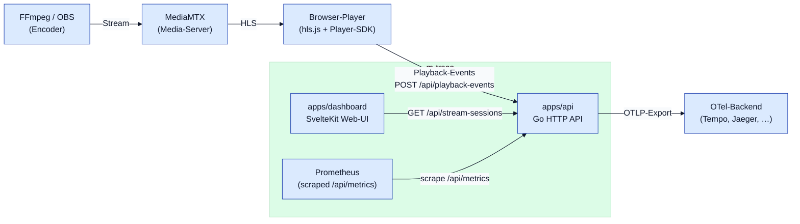
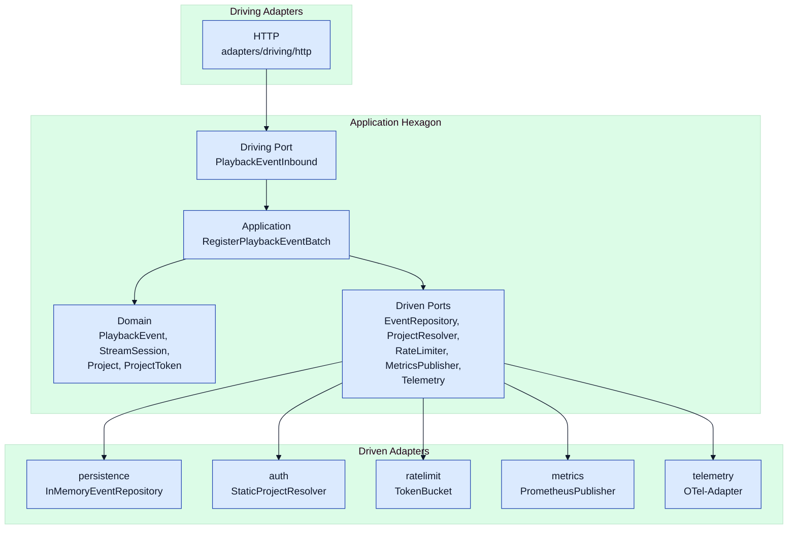
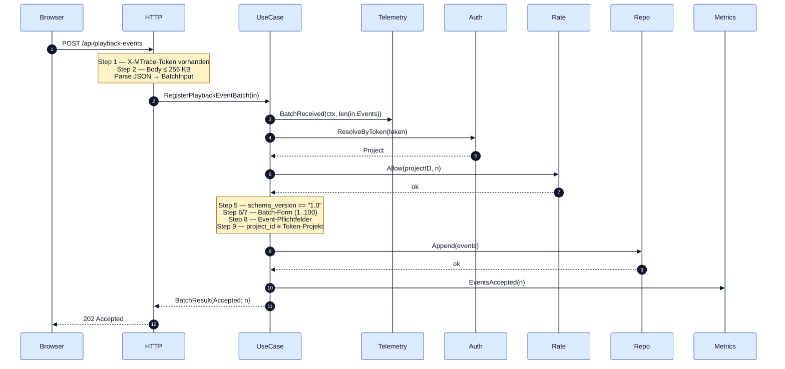
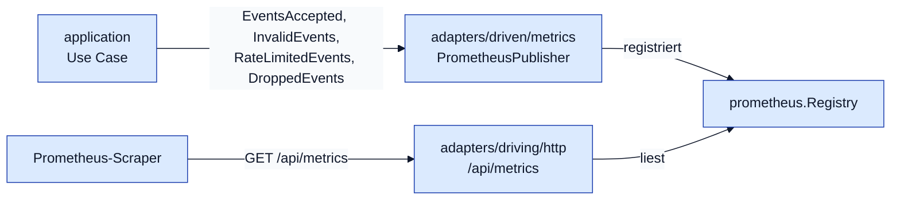
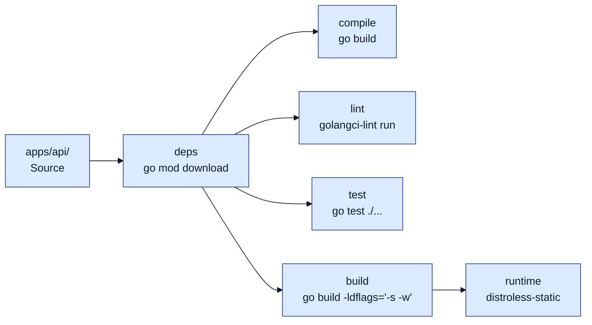
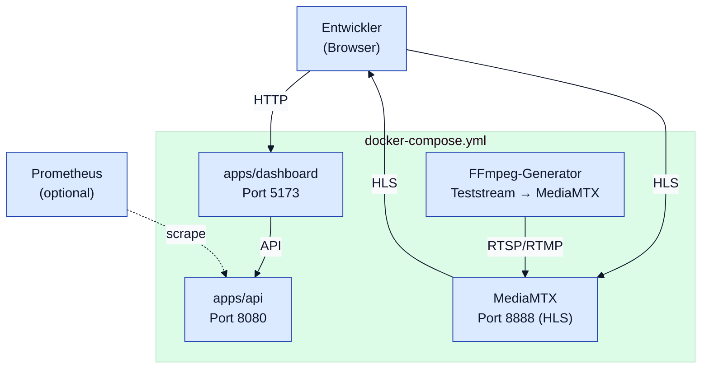

# Architektur — m-trace

## 0. Dokumenteninformationen

| Feld | Wert |
|---|---|
| Dokument | Architektur `m-trace` |
| Stand | `2026-04-29` |
| Status | Verbindlich (Zielbild `0.1.0`) |
| Bezug | [Lastenheft `1.1.0`](./lastenheft.md), [ADR-0001](./adr/0001-backend-stack.md), [Plan-Spike](./plan-spike.md), [Plan-`0.1.0`](./plan-0.1.0.md) / [`0.1.1`](./plan-0.1.1.md) / [`0.1.2`](./plan-0.1.2.md) (Lieferstand), [Roadmap](./roadmap.md), [Risiken-Backlog](./risks-backlog.md) |

### 0.1 Zweck

Dieses Dokument beschreibt das **Zielbild (Soll)** der `0.1.0`-Architektur — *wie* die Anforderungen aus dem Lastenheft strukturell umgesetzt werden sollen. Es führt das Lastenheft nicht erneut, sondern erklärt Hexagon-Aufteilung, Verzeichnisstruktur, Abhängigkeitsregeln, Datenflüsse und die Querverweise zu den Architektur-Entscheidungen (ADRs).

**Soll/Ist-Trennung**: Dieses Dokument enthält **kein** Status-Tracking. Der Lieferstand (was umgesetzt ist, was offen ist) wird ausschließlich an folgenden Stellen geführt:

- [`docs/plan-0.1.0.md`](./plan-0.1.0.md) — DoD-Checkboxen `[x]`/`[ ]` mit Commit-Hashes pro Tranche.
- [`docs/roadmap.md`](./roadmap.md) §1.1, §1.2, §2 — Status auf Schritt-Ebene (✅/⬜/🟡).
- `apps/<app>/README.md` — Stand pro App-Komponente.
- `CHANGELOG.md` — versionierter Lieferstand pro Release-Tag.
- der Code selbst — kanonische ausführbare Wahrheit.

Differenzen Code↔Soll werden **nicht** durch weichere Architektur-Formulierungen kaschiert, sondern als Aufgabe in `docs/plan-0.1.0.md` getrackt — der Code zieht das Soll ein, oder das Soll wird begründet via ADR angepasst.

### 0.2 Nicht-Ziel

- Anforderungen formulieren — das ist Aufgabe von [`lastenheft.md`](./lastenheft.md).
- Release-Plan oder Status verfolgen — siehe [`roadmap.md`](./roadmap.md).
- Stack-Entscheidungen begründen — siehe ADRs unter `docs/adr/`.
- Risiken sammeln — siehe [`risks-backlog.md`](./risks-backlog.md).

### 0.3 Architekturstil

m-trace nutzt **Hexagonale Architektur (Ports & Adapters)** für Komponenten mit echter fachlicher Anwendungslogik. Andere Komponenten bleiben bewusst pragmatisch:

| Komponente | Architektur | Begründung |
|---|---|---|
| `apps/api` | hexagonal | echte Domain-Logik (Event-Annahme, Validierung, Session-Modell vorbereitet) |
| `apps/dashboard` | Feature-Struktur | UI-Code, kein Domain-Kern |
| `packages/player-sdk` | leichte Adapter-Struktur | Browser-Library, Hexagon ohne Mehrwert im MVP |
| `packages/stream-analyzer` | hexagonal oder geschichtete Library | Einsatz pro Folge-Phase prüfen |

Die Backend-Stack-Wahl (Go) ist in [ADR-0001](./adr/0001-backend-stack.md) entschieden.

---

## 1. Architekturziele

Die Akzeptanzkriterien aus Lastenheft §14 sind die Leitplanken für dieses Dokument:

| AK | Ziel | Wirkt sich aus auf |
|---|---|---|
| AK-3 | Architektur ist klar nachvollziehbar | §3 Hexagon, §4 Verzeichnisstruktur, §5 Datenflüsse |
| AK-4 | Domain-Schicht ist frameworkfrei | §3.2 Application Core, §6 Querschnitt |
| AK-5 | Adapter sind technisch klar getrennt | §3.4 Adapter, §4 Verzeichnisstruktur |
| AK-9 | Basis-Metriken sind sichtbar oder vorbereitet | §6 Querschnitt, §5 Datenflüsse |
| AK-10 | Repository ist Open-Source-tauglich dokumentiert | dieses Dokument |

---

## 2. Kontext

### 2.1 Systemkontext



### 2.2 Architekturtreiber

| Treiber | Konsequenz |
|---|---|
| Selbsthoster-first (Lastenheft §9.3) | einfache Deploybarkeit, Distroless-Runtime, Docker-Compose statt Kubernetes |
| OpenTelemetry-nativ (§4.2) | OTel-SDK direkt in `apps/api`, keine vendor-spezifischen Telemetrie-Pfade |
| Cardinality-Sicherheit (§7.10) | Prometheus nur für Aggregate, hohe Kardinalität in Trace/Event-Store |
| Player-First (§7.6) | Wire-Format und SDK-Budget im Lastenheft fixiert; API-Kontrakt frozen (`docs/spike/backend-api-contract.md`) |
| Hexagon-Disziplin (§7.2 F-10..F-16) | Application-Core ohne Framework-Abhängigkeit, technische Konzepte in Adaptern |

---

## 3. Hexagonale Zerlegung

### 3.1 Übersicht



Telemetrie ist konsequent als Driven Port modelliert (`Telemetry`), nicht als Querschnitt-Spezialfall. Damit importiert `hexagon/` keinen OTel-Code; die OTel-Bibliothek lebt ausschließlich im Adapter `adapters/driven/telemetry`. Request-Spans am HTTP-Boundary erzeugt zusätzlich der `adapters/driving/http`-Adapter direkt — siehe §5.3.

Naming: in `apps/api/` stehen die Pakete unter `port/driving/` und `port/driven/` bzw. `adapters/driving/` und `adapters/driven/`. Lastenheft §7.2 schreibt den Stil mit `port/in/`, `port/out/`, `adapters/in/`, `adapters/out/` als Standardstruktur — beide Konventionen sind in der Hexagon-Literatur gleichwertig; m-trace folgt der `driving/driven`-Variante, weil sie die Aufrufrichtung sprachlich klarer markiert.

### 3.2 Application Core

`hexagon/` enthält ausschließlich frameworkfreien Code:

| Paket | Inhalt | Regeln |
|---|---|---|
| `hexagon/domain/` | `PlaybackEvent`, `StreamSession`, `Project`, `ProjectToken`, Domain-Errors | keine HTTP-, JSON-, Prometheus-, OTel-, Persistenz-Imports |
| `hexagon/port/driving/` | `PlaybackEventInbound` (Use-Case-Eingang) und Wire-format-neutrale DTOs (`BatchInput`, `EventInput`, `SDKInput`, `BatchResult`) | keine Imports von `adapters/*`; DTOs trennen Domain von Wire-Format |
| `hexagon/port/driven/` | `EventRepository`, `ProjectResolver`, `RateLimiter`, `MetricsPublisher`, `Telemetry` | reine Schnittstellen; Implementierungen in `adapters/driven/*`. Keine Imports von OTel, Prometheus oder anderen Adapter-Bibliotheken. |
| `hexagon/application/` | `RegisterPlaybackEventBatch` Use Case | orchestriert Validierung, Auth, Rate-Limit, Persistenz, Metriken, Telemetrie in fester Reihenfolge laut [API-Kontrakt §5](./spike/backend-api-contract.md) |

Die Domain-Errors (`ErrSchemaVersionMismatch`, `ErrUnauthorized`, `ErrBatchEmpty`, `ErrBatchTooLarge`, `ErrInvalidEvent`, `ErrRateLimited`) decken erwartete fachliche Fehlerkategorien ab. Der HTTP-Adapter mappt sie auf Status-Codes (Tabelle in §5.1). Technische Adapter-Fehler — z. B. von `EventRepository.Append` — fallen nicht in dieses Set; sie werden vom Use Case unverändert durchgereicht und vom HTTP-Adapter im Default-Zweig auf `500` gemappt.

### 3.3 Ports

Driving Ports werden vom Adapter aufgerufen:

```go
type PlaybackEventInbound interface {
    RegisterPlaybackEventBatch(ctx context.Context, in BatchInput) (BatchResult, error)
}
```

Driven Ports werden vom Use Case aufgerufen:

```go
type EventRepository interface {
    Append(ctx context.Context, events []domain.PlaybackEvent) error
}

type ProjectResolver interface {
    ResolveByToken(ctx context.Context, token string) (domain.Project, error)
}

type RateLimiter interface {
    Allow(ctx context.Context, projectID string, n int) error
}

type MetricsPublisher interface {
    EventsAccepted(n int)
    InvalidEvents(n int)
    RateLimitedEvents(n int)
    DroppedEvents(n int)
}

type Telemetry interface {
    BatchReceived(ctx context.Context, size int)
}
```

`Telemetry` ist die framework-neutrale Fassade für OTel-Aufrufe aus dem Use Case. Implementierung in `adapters/driven/telemetry` mappt `BatchReceived` auf einen `Int64Counter` (`mtrace.api.batches.received`) mit `batch.size` als Attribut. Weitere Methoden (z. B. `BatchValidated`, `BatchPersisted`) werden bei Bedarf ergänzt — die Domain kennt nur die Port-Signatur, nicht OTel.

### 3.4 Adapter

Adapter dürfen `hexagon/` importieren, niemals umgekehrt. Compile-Time-Enforcement der Implementierungs-Treue erfolgt über Sentinel-Checks:

```go
var _ driven.EventRepository = (*InMemoryEventRepository)(nil)
```

Adapter im Zielbild `0.1.0` (`apps/api/`):

| Pfad | Rolle | Implementierung | Hinweis |
|---|---|---|---|
| `adapters/driving/http/` | Driving | `PlaybackEventsHandler`, `HealthHandler`, Router (Go-1.22-Method-Routing); Request-Spans via `otel.Tracer` | mountet Prometheus-Handler aus `metrics`-Adapter; setzt Span-Attribute für Status-Code und (bei Erfolg) `batch.size`. |
| `adapters/driven/auth/` | Driven | `StaticProjectResolver` | static-Map-Lookup auf `X-MTrace-Token`; spätere Auth-Backends (Folge-ADR) ersetzen die Implementierung ohne Änderungen am Use Case. |
| `adapters/driven/persistence/` | Driven | `InMemoryEventRepository` | wechselt mit Persistenz-Folge-ADR (Roadmap §4) auf SQLite/PostgreSQL, OE-3. |
| `adapters/driven/ratelimit/` | Driven | `TokenBucket` | 100 Events/s/Project laut API-Kontrakt §6. |
| `adapters/driven/metrics/` | Driven | `PrometheusPublisher` | exposed über `/api/metrics`; vier Pflicht-Counter (siehe §5.2). |
| `adapters/driven/telemetry/` | Driven | implementiert `Telemetry`-Port via OTel-`Int64Counter` (`mtrace.api.batches.received`); Setup von `MeterProvider` und `TracerProvider` mit `autoexport`-Reader/Span-Exporter | siehe §5.3 für Setup- und Exporter-Vertrag. |

OTel-Imports innerhalb der Anwendung sind ausschließlich in zwei Pfaden zulässig:

- `adapters/driven/telemetry/` — implementiert den `Telemetry`-Port und das OTel-SDK-Setup.
- `adapters/driving/http/` — erzeugt Request-Spans am HTTP-Boundary.

Alle Pakete unterhalb `hexagon/` importieren weder `go.opentelemetry.io/otel` noch dessen Sub-Pakete. Übrige Adapter unter `adapters/driven/{auth,metrics,persistence,ratelimit}/` ebenfalls nicht. `cmd/api/` darf den Telemetry-Adapter wiring-mäßig importieren und sieht OTel daher transitiv — das ist kein Boundary-Verstoß.

Die Regel betrifft also **direkte** Imports und gilt geschichtet. Verbindliche Boundary-Tabelle:

| Paket-Pattern | Verbotene direkte Imports | Begründung |
|---|---|---|
| `./hexagon/...` | `${MODULE}/adapters`, `go.opentelemetry.io`, `github.com/prometheus`, `database/sql`, `net/http` | Hexagon darf keine Adapter oder Infrastruktur-Bibliotheken kennen. |
| `./hexagon/domain/...` | `${MODULE}/hexagon/application`, `${MODULE}/hexagon/port` | Domain darf nicht von Application oder Ports abhängen. |
| `./hexagon/application/...` | `${MODULE}/adapters` | Application spricht ausschließlich über Ports, nicht Adapter-Implementierungen. |
| `./hexagon/port/...` | `${MODULE}/adapters` | Ports sind Abstraktionen — sie dürfen keine Adapter-Implementierung importieren. |

Absicherung als ausführbares Skript: `apps/api/scripts/check-architecture.sh` (auch als `make arch-check` aufrufbar). Das Skript iteriert über die Patterns, sammelt pro Paket die direkten Imports via `go list -f '{{join .Imports "\n"}}'` und filtert sie gegen den jeweiligen Forbidden-Regex. Bei einem Treffer wird Paketname, Begründung und Liste der verbotenen Imports ausgegeben und der Lauf bricht mit Exit 1 ab.

`go list -deps` greift bewusst zu weit: weil `cmd/api` den Telemetry-Adapter zieht, würde der transitive Schluss OTel zwangsläufig zeigen. Der Direkt-Import-Filter (`Imports` statt `Deps`) ist die richtige Granularität.

---

## 4. Verzeichnis- und Modulstruktur

### 4.1 Zielstruktur Mono-Repo (`0.1.0`)

```text
m-trace/
├── apps/
│   ├── api/                         # Backend-API (Go, hexagonal)
│   └── dashboard/                   # Web-Dashboard (SvelteKit)
├── packages/
│   ├── player-sdk/                  # Player-SDK (TypeScript)
│   ├── stream-analyzer/             # Manifest-Analyzer (Phase 0.3.0)
│   ├── shared-types/                # gemeinsame Typen
│   └── config/                      # gemeinsame Konfiguration
├── services/
│   ├── stream-generator/            # FFmpeg-Teststream
│   ├── otel-collector/              # OpenTelemetry Collector
│   └── media-server/                # MediaMTX
├── observability/
│   ├── prometheus/
│   ├── grafana/
│   └── otel/
├── docs/
└── docker-compose.yml               # Lokal-Lab
```

Dies ist die Soll-Struktur für `0.1.0`; aktueller Implementierungsstand pro Verzeichnis steht in [`plan-0.1.0.md`](./plan-0.1.0.md) (Tranche 1) und in der Roadmap §1.1.

### 4.2 Hexagon-Layout pro App (`apps/api/` exemplarisch)

```text
apps/api/
├── cmd/
│   └── api/
│       └── main.go                  # Wiring + HTTP-Server-Lifecycle
├── hexagon/
│   ├── domain/                      # framework-frei
│   ├── port/
│   │   ├── driving/
│   │   └── driven/
│   └── application/                 # Use Cases
├── adapters/
│   ├── driving/
│   │   └── http/
│   └── driven/
│       ├── auth/
│       ├── metrics/
│       ├── persistence/
│       ├── ratelimit/
│       └── telemetry/
├── go.mod                           # github.com/pt9912/m-trace/apps/api
├── go.sum
├── Dockerfile                       # multi-stage: deps, compile, lint, test, build, runtime
├── Makefile                         # docker-only-Targets
└── README.md
```

### 4.3 Konventionen

- Hexagon-Pakete liegen flach unter `apps/<app>/hexagon/`. Kein zusätzliches `src/`-Niveau.
- `cmd/<binary>/main.go` ist der einzige Ort, an dem Adapter und Use Cases verdrahtet werden.
- Adapter-Pakete sind nach technischer Capability benannt (`auth`, `persistence`, `ratelimit`), nicht nach Provider-Namen.
- Compile-Time-Sentinel-Checks (`var _ Interface = (*Impl)(nil)`) gehören in dieselbe Datei wie die Implementierung, am Anfang nach den Imports.

---

## 5. Datenfluss

### 5.1 Event-Ingest

Der zentrale Datenfluss ist die Annahme eines Player-Event-Batches. Validierungsreihenfolge laut [API-Kontrakt §5](./spike/backend-api-contract.md) (Schritte 1 und 2 im HTTP-Adapter, Schritte 3..10 im Use Case):

Akteure:

- **Browser** — Player-SDK
- **HTTP** — `adapters/driving/http.PlaybackEventsHandler`
- **UseCase** — `application.RegisterPlaybackEventBatch`
- **Telemetry** — `adapters/driven/telemetry.OTelTelemetry` (über `Telemetry`-Port)
- **Auth** — `adapters/driven/auth.StaticProjectResolver`
- **Rate** — `adapters/driven/ratelimit.TokenBucket`
- **Repo** — `adapters/driven/persistence.InMemoryEventRepository`
- **Metrics** — `adapters/driven/metrics.PrometheusPublisher`



Schritt-Nummerierung (1..10) entspricht dem API-Kontrakt §5; Schritte 1 (Auth-Header-Presence) und 2 (Body-Größe) laufen im HTTP-Adapter, Schritt 3 (Token-Auflösung) bis Schritt 10 (Erfolg) im Use Case. Auth steht bewusst **vor** dem Body-Read, damit unauthentifizierte Requests einen Fast-Reject-Pfad haben.

Fehlerpfade — Status-Codes laut [API-Kontrakt §5](./spike/backend-api-contract.md), Counter laut [API-Kontrakt §7](./spike/backend-api-contract.md):

| Stufe | Fehler | Status | Counter | Geprüft in |
|---|---|---|---|---|
| Auth-Header | fehlt | 401 | — | HTTP-Adapter Step 1 |
| Body | Größe > 256 KB | 413 | — | HTTP-Adapter Step 2 |
| Auth-Token | Token unbekannt | 401 | — | Use Case Step 3 |
| Rate-Limit | Budget aufgebraucht | 429 + `Retry-After` | `mtrace_rate_limited_events_total` | Use Case Step 4 |
| schema_version | ≠ `"1.0"` | 400 | `mtrace_invalid_events_total` | Use Case Step 5 |
| Batch-Form | leer | 422 | — (Counter bleibt unverändert: n=0 abgelehnte Events) | Use Case Step 6 |
| Batch-Größe | > 100 Events | 422 | `mtrace_invalid_events_total` | Use Case Step 7 |
| Event-Felder | Pflichtfeld fehlt | 422 | `mtrace_invalid_events_total` | Use Case Step 8 |
| Token-Bindung | `project_id` ≠ Token-Projekt | 401 | — | Use Case Step 9 |
| Persistenz | Repository-Fehler | 500 | — (kein Counter; Sichtbarkeit über HTTP-5xx-Histogramm und Logs) | Use Case Step 10 |

`mtrace_invalid_events_total` zählt **abgelehnte Events** mit Status `400` oder `422` (laut [API-Kontrakt §7](./spike/backend-api-contract.md)) — der Wertbereich ist die Anzahl betroffener Events, nicht die Anzahl Batches. Auth-Fehler (HTTP-Header-Check, `ResolveByToken`, Token-Bindung) laufen nicht in den Counter. Bei leerem Batch (`events.length == 0`) bleibt der Counter folglich unverändert; die Ablehnung ist über HTTP-Status (`422`) und Access-Logs sichtbar. Persistenz-Fehler (`500`) inkrementieren ebenfalls keinen Counter — `mtrace_dropped_events_total` ist laut Kontrakt §7 für **interne Backpressure-Drops** reserviert (z. B. ein zukünftiger Async-Channel mit überlaufendem Puffer), nicht für synchron-fehlgeschlagenes `Append`.

### 5.2 Metrics-Pfad



Pflicht-Counter (laut [API-Kontrakt §7](./spike/backend-api-contract.md)):

- `mtrace_playback_events_total`
- `mtrace_invalid_events_total`
- `mtrace_rate_limited_events_total`
- `mtrace_dropped_events_total`

Hochkardinale Werte (`session_id`, `user_agent`, `segment_url`) sind als Prometheus-Labels **verboten** (Lastenheft §7.10). Per-Session-Diagnose erfolgt über Trace/Event-Store, nicht über Metriken.

### 5.3 Telemetrie-Pfad

OTel-Telemetrie verläuft über zwei sich ergänzende Pfade — beide ohne OTel-Import in `hexagon/`:

**Driven Port `Telemetry`** (Use-Case-Telemetrie):

`hexagon/port/driven/Telemetry` ist eine framework-neutrale Schnittstelle. Der Use Case ruft `telemetry.BatchReceived(ctx, len(in.Events))` am Eintritt jedes Aufrufs (siehe §5.1 Sequenzdiagramm). Der Adapter `adapters/driven/telemetry` implementiert die Methode mit einem OTel-`Int64Counter` namens `mtrace.api.batches.received`, der `batch.size` als Attribut trägt. Damit ist die Pflicht aus [API-Kontrakt §8](./spike/backend-api-contract.md) („mindestens ein Counter oder Span erzeugt") erfüllt.

**Request-Span im HTTP-Adapter**:

`adapters/driving/http` erzeugt um jeden `POST /api/playback-events`-Aufruf einen OTel-Span via `otel.Tracer` (Span-Name `http.handler POST /api/playback-events` oder vergleichbar). Status-Code, `batch.size` (aus Use-Case-Result) und gegebenenfalls die Domain-Error-Klasse werden als Span-Attribute gesetzt. Der HTTP-Adapter darf OTel direkt importieren — er ist die Adapter-Schicht.

**Initialisierung und Exporter-Default**:

`adapters/driven/telemetry/Setup` registriert in `main.go` einen prozesslokalen `MeterProvider` und `TracerProvider` mit Service-Resource (`service.name`, `service.version`). Reader und Span-Exporter werden über `go.opentelemetry.io/contrib/exporters/autoexport` aufgelöst.

Der Soll-Default ist **silent**, weicht damit vom autoexport-Default ab: ohne Env-Vars defaulten `OTEL_TRACES_EXPORTER` und `OTEL_METRICS_EXPORTER` in autoexport auf `otlp` und nicht auf No-Op. Damit lokales Dev *ohne* OTel-Backend nicht standardmäßig OTLP-Verbindungsversuche unternimmt, ruft `Setup` autoexport mit explizitem No-Op-Fallback auf:

```go
reader, _ := autoexport.NewMetricReader(ctx,
    autoexport.WithFallbackMetricReader(noopMetricReaderFactory),
)
exporter, _ := autoexport.NewSpanExporter(ctx,
    autoexport.WithFallbackSpanExporter(noopSpanExporterFactory),
)
```

Damit gilt für die [Standard-OTel-Env-Vars](https://opentelemetry.io/docs/specs/otel/configuration/sdk-environment-variables/):

| Konfiguration | Effekt |
|---|---|
| keine Env-Vars | Fallback aktiv → No-Op-Reader und No-Op-Span-Exporter, Provider silent. |
| `OTEL_TRACES_EXPORTER=otlp` und/oder `OTEL_METRICS_EXPORTER=otlp` | OTLP-Reader und/oder OTLP-Span-Exporter werden registriert. |
| `OTEL_EXPORTER_OTLP_ENDPOINT=…` | Endpoint für die OTLP-Variante. |
| `OTEL_EXPORTER_OTLP_PROTOCOL=…` | Wahl des Transport-Protokolls (`grpc`, `http/protobuf`). Default-Protokoll richtet sich nach der eingebundenen `autoexport`-Modulversion. |
| `OTEL_TRACES_EXPORTER=console` | Console-Exporter für Debug. |
| `OTEL_TRACES_EXPORTER=none` (analog Metrics) | explizit kein Exporter — ist auch ohne Fallback silent. |

Lokales Dev läuft ohne Konfiguration silent durch; produktive Setups setzen die Env-Vars und brauchen keinen Code-Patch. `autoexport` ist die einzige zusätzliche OTel-Abhängigkeit, die das Soll vorsieht; die exakte autoexport-Version wird in `apps/api/go.mod` gepinnt.

---

## 6. Querschnittsthemen

| Thema | Umsetzung | Bezug |
|---|---|---|
| Logging | `log/slog` mit JSON-Handler, einmalig in `main.go` als Default gesetzt | Lastenheft §10.1 |
| Tracing & OTel-Counter | Driven Port `Telemetry` (siehe §3.3) wird vom Use Case aufgerufen; Adapter `adapters/driven/telemetry` mappt auf OTel-`Int64Counter` (`mtrace.api.batches.received`). Request-Spans erzeugt der HTTP-Adapter direkt via `otel.Tracer`. Reader/Exporter via `autoexport` mit No-Op-Fallback: ohne Env-Vars silent, mit `OTEL_TRACES_EXPORTER=otlp` (analog Metrics) wird OTLP registriert. Domain und Use Case bleiben OTel-frei. | ADR-0001 §5; API-Kontrakt §8 |
| Metriken | Prometheus über `/api/metrics`-Endpoint, nur Aggregate | Lastenheft §7.9, §7.10 |
| Auth | Header `X-MTrace-Token`, Auflösung über `ProjectResolver` | Spike-Spec §6.4, Lastenheft §8.5 |
| Rate Limiting | In-Memory Token-Bucket, 100 Events/s/Project | Spike-Spec §6.9 |
| Konfiguration | Konstanten in `cmd/api/main.go`; Umweltvariablen folgen ab `0.1.0`-Implementierung | — |

---

## 7. Architekturelle Entscheidungen

### 7.1 Bestand

| ADR | Status | Inhalt |
|---|---|---|
| [ADR-0001](./adr/0001-backend-stack.md) | Accepted | Backend-Stack: Go 1.22, stdlib `net/http`, Prometheus, OpenTelemetry, Distroless |

### 7.2 Geplant

Folge-ADRs aus [Roadmap §4](./roadmap.md):

| Erwartete ADR | Trigger-Release | Bezug |
|---|---|---|
| Persistenz-Wechsel In-Memory → SQLite/PostgreSQL | `0.1.0`–`0.2.0` | MVP-16, OE-3 |
| WebSocket vs. SSE für Live-Updates | `0.4.0` | OE-5, R-3 |
| SRT-Binding-Stack | `0.6.0` | R-2 |
| Coverage-Tooling für Go | `0.1.0`+ | analog d-migrate-Pattern |
| `apps/api` Multi-Modul-Aufteilung (`go.work`) | on demand | R-1 |

Die zugehörigen technischen Risiken stehen in [`risks-backlog.md`](./risks-backlog.md).

---

## 8. Build und Runtime

### 8.1 Docker-only-Workflow

Alle Build-, Test-, Lint- und Runtime-Schritte laufen über `docker build --target …`. Lokales Go ist optional. Der Workflow folgt [Plan-Spike §14.11](./plan-spike.md):



| Stage | Image | Zweck |
|---|---|---|
| `deps` | `golang:1.22` | `go mod download`, Cache-Layer |
| `compile` | `golang:1.22` | schneller `go build` für Iteration |
| `lint` | `golangci/golangci-lint:v1.62-alpine` | Default-Linters laut Lastenheft §10.1 |
| `test` | `golang:1.22` | `go test ./...` |
| `build` | `golang:1.22` | Stripped binary (`-s -w`) für Runtime |
| `runtime` | `gcr.io/distroless/static-debian12:nonroot` | Final-Image (~10 MB, Cold-Start ~9 ms) |

### 8.2 Lokal-Lab

Das `0.1.0`-Compose-Setup startet vier Services aus dem Repo-Wurzelverzeichnis:



---

## 9. Rückverfolgbarkeit

| Architektur-Aussage | Dokument-§ | Lastenheft / AK |
|---|---|---|
| Hexagonale Aufteilung mit framework-freier Domain | §3 | F-10..F-16, AK-3, AK-4 |
| Trennung driving/driven Adapter | §3.4 | F-11, F-15, AK-5 |
| Verzeichnislayout `apps/api/` | §4 | §7.1 Mono-Repo |
| Validierungsreihenfolge im Use Case | §5.1 | API-Kontrakt §5 |
| Prometheus nur für Aggregate | §5.2, §6 | §7.10 Cardinality-Regel, AK-9 |
| OpenTelemetry-Querschnitt | §5.3, §6 | §4.2, §10.1 |
| Docker-only-Workflow, Distroless | §8.1 | §10.1, ADR-0001 §6 |
| Repository-Doku-Tauglichkeit | dieses Dokument | AK-10 |

---

## 10. Offene Architekturfragen

Verweise auf die normativen Listen statt Duplikat:

- Offene Lastenheft-Entscheidungen: [Roadmap §5](./roadmap.md) (OE-1, OE-3..OE-8).
- Bekannte Phase-2-Risiken: [`risks-backlog.md`](./risks-backlog.md) (R-1..R-3).
- Erwartete Folge-ADRs: [Roadmap §4](./roadmap.md).

Architekturfragen, die hier *neu* aufgerufen werden, kommen über einen Folge-ADR oder einen `risks-backlog.md`-Eintrag in den Bestand.
