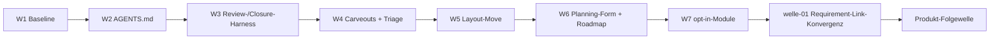

# Roadmap

**Status:** Aktiv. **Letzte Änderung:** 2026-07-23.

**Format-Regel:** Diese Roadmap ist eine Reihenfolge von **Wellen**, keine
Reihenfolge von Terminen (v3.5.0-Regelwerk Modul 6). Ein Trigger ist eine
*beobachtbare Bedingung* (nicht ein Datum); Termine erscheinen höchstens als
Schätzung, treiben aber nie eine Welle.

> **Historie vor v3.5.0.** Die vollständige Release- und Entscheidungshistorie
> bis `0.25.0` (25 Release-/Patch-Pläne, Trigger-Re-Evals, Lessons-learned) steht
> im Archiv [`../done/roadmap-pre-v3.5.0.md`](../done/roadmap-pre-v3.5.0.md) und
> in den einzelnen [`done/plan-*.md`](../done/)-Records. Diese Datei ist bewusst
> altlastenfrei und forward-looking.

---

## Aktuelle Welle

**Keine aktive Welle.** `welle-01` (Requirement-Link-Konvergenz) ist abgeschlossen
(siehe *Abgeschlossene Wellen*); eine Produkt-Folgewelle ist noch **nicht
geschnitten** (siehe *Nächste Wellen*). Die nächste Welle beginnt, sobald der
Owner eine Tranche aus den Register-Kandidaten schneidet.

**Slices ohne Welle seit `welle-01`** (Wartung/Architektur, Modul 5 „ohne Welle",
alle in [`done/`](../done/)): [`slice-003`](../done/slice-003-a-check-arch-gate.md)
(a-check ersetzt `check-architecture.sh`),
[`slice-004`](../done/slice-004-driving-port-boundary.md) (Driving-Port-Boundary
säubern), [`slice-005`](../done/slice-005-closure-gate-slice-welle.md)
(Closure-Gate greift auf slice/welle), [`slice-006`](../done/slice-006-planning-layout-nicht-slices-flach.md)
(Planning-Layout: Nicht-Slices flach aus `in-progress/`).

## Nächste Wellen

| Welle | Trigger (beobachtbar) | Wichtigste Slices | Aufwand |
|---|---|---|---|
| Produkt-Folgewelle (noch **ungeschnitten**) | Migration done **und** Owner schneidet Tranche | Kandidaten aus dem Risiko-Register: `R-30` (SSE-Backfill-Skip Multi-Replica), `R-24` (Load-Smoke-Debounce), policy-getriebene Per-Projekt-Limiter-Buckets ([`RAK-74`](../../../../spec/lastenheft.md#rak-74)-Anschluss), Redis-Cluster-Tauglichkeit der Lua-Limiter, Durchsatz jenseits Single-Postgres (`budgets.md` §8) | S–L (je Schnitt) |

Es liegt **keine geschnittene Produkt-Tranche** vor. Die Kandidaten sind im
[Risiko-Register](../risks-backlog.md) mit Triggern geführt (Roadmap-Discovery,
MR-005; Werkzeug-Einordnung in der
[Triage](../risks-backlog-werkzeug-triage.md)) — keiner ist ein aktiver Blocker.
Mutation-Gate-Blockierung bleibt deferred, bis echte >70 %-Score-Reihen vorliegen.

**Nächster Slice-Kandidat ohne Welle:** das Review-Harness (Modul 8/10,
`docs/reviews/`) ist eingerichtet, aber ungenutzt — bisherige Reviews landeten
ad-hoc in Commit-Messages/Memory statt als Kanon-Review-Reports (Sekundärbefund
aus `slice-006`; erster echter Record ist die migrierte
[`2026-05-13-r13-trivy-rereview.md`](../../../reviews/2026-05-13-r13-trivy-rereview.md)).
Slice-Idee: Review-Praxis auf Kanon-Review-Reports umstellen (Template + Skill).

## Meilensteine

| Meilenstein | Welle(n) | Trigger (extern) | Status |
|---|---|---|---|
| `0.25.0` released | Multi-Tenant-Fairness + Cutover | Tag `v0.25.0` + GHCR/npm-Publish (2026-07-13) | erreicht |
| v3.5.0-Harness-Migration abgeschlossen | W1–W7 | W7 done, `make gates` grün (2026-07-23) | erreicht |

## Abhängigkeitsgraph

## Abgeschlossene Wellen

| Welle | Abschluss | Closure-/Ergebnis-Record |
|---|---|---|
| Produkt-Releases `0.1.0`–`0.25.0` (25 Pläne) | bis 2026-07-13 | [`../done/plan-*.md`](../done/) · Übersicht: [`roadmap-pre-v3.5.0.md`](../done/roadmap-pre-v3.5.0.md) |
| Migration W1 — Vendored Baseline | 2026-07-22 | [Plan §2](../done/plan-harness-v3.5.0-migration.md) (`.harness/baseline/v3.5.0/` + SHA256SUMS) |
| Migration W2 — AGENTS.md | 2026-07-22 | [Plan §2](../done/plan-harness-v3.5.0-migration.md) |
| Migration W3 — Review-/Closure-Harness | 2026-07-22 | [Plan §2](../done/plan-harness-v3.5.0-migration.md) ([ADR-0010](../../adr/0010-closure-note-pflicht.md)) |
| Migration W4 — Carveouts + Werkzeug-Triage | 2026-07-23 | [Triage](../risks-backlog-werkzeug-triage.md), MR-005/006 |
| Migration W5 — Layout-Move (`docs/plan/…`) | 2026-07-23 | [Plan §3/§5](../done/plan-harness-v3.5.0-migration.md), MR-001 aufgelöst |
| Migration W6 — Planning-Form + Roadmap-Reformat | 2026-07-23 | [Plan §2](../done/plan-harness-v3.5.0-migration.md), MR-007 |
| Migration W7 — `version.md` + `versions`-Modul | 2026-07-23 | [Plan §2](../done/plan-harness-v3.5.0-migration.md); `ids` → `welle-01` |
| **welle-01 — Requirement-Link-Konvergenz** | 2026-07-23 | [`welle-01-results.md`](../done/welle-01-results.md) (slice-001 + slice-002; `ids` repo-weit) |

> Der Bestand ist grandfathered (MR-007): abgeschlossene Produktarbeit liegt als
> `plan-<version>.md` in `done/`, nicht als `welle-<NN>-results.md`. Neue Wellen
> ab der Produkt-Folgewelle folgen der kanonischen Form.

## Historische Trigger-Verschiebungen

| Datum | Was wurde geändert? | Warum? |
|---|---|---|
| 2026-07-21 | Adoption der vollen v3.5.0-Form (Wellen/Slices für neue Arbeit, Roadmap-Reformat, opt-in-Module als W7) | Owner-Entscheidung; strukturelle statt bloß versionierter Adoption |
| 2026-07-23 | Diese Roadmap neu angelegt (Kanon-Form); historienlastige Fassung nach `done/roadmap-pre-v3.5.0.md` archiviert | W6-Reformat — forward-looking Roadmap, Historie als Audit-Bestand erhalten |

> Die vollständigen Pre-v3.5.0-Verschiebungen (Trigger-Re-Evals `0.12.1`/`0.18.0`/
> `0.19.0`, Szenario-Entscheidungen `0.15.0`–`0.17.0` u. a.) stehen im Archiv
> [`roadmap-pre-v3.5.0.md`](../done/roadmap-pre-v3.5.0.md).
