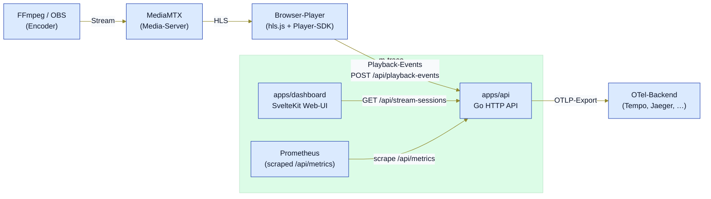
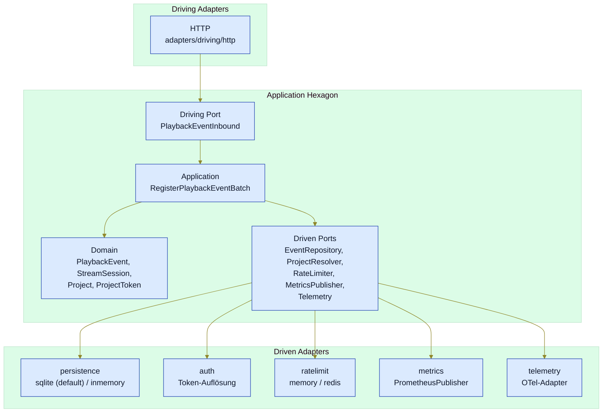
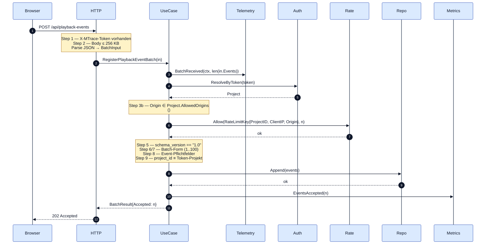
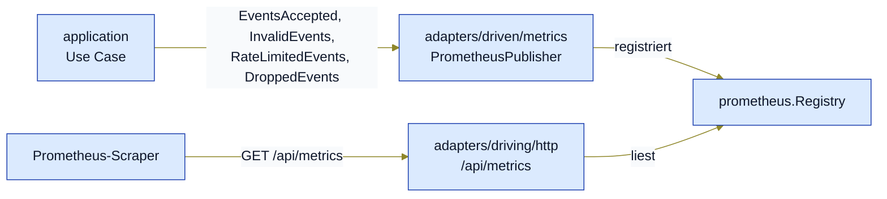
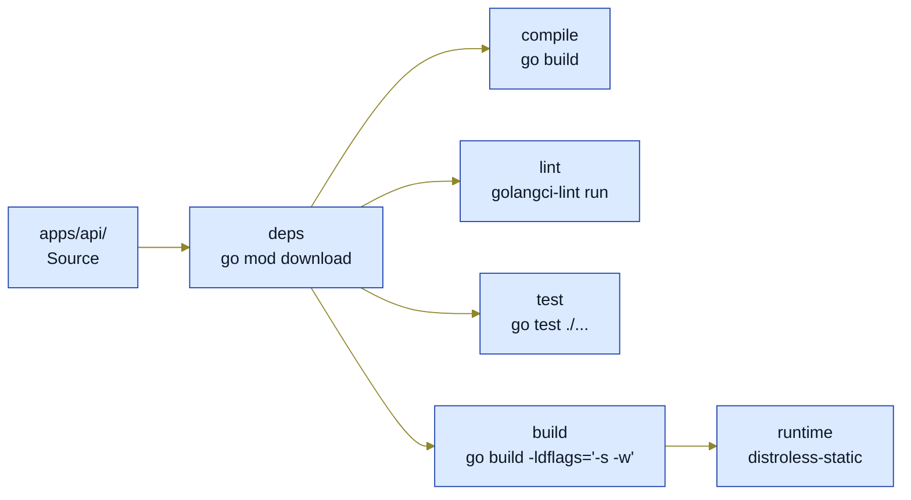
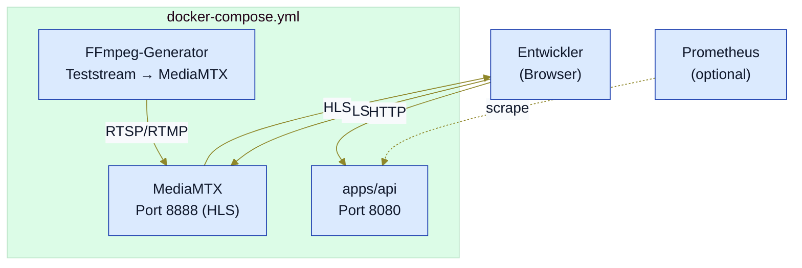

# Architektur — m-trace

## 0. Dokumenteninformationen

> **Bezug**: [`AK-1`](lastenheft.md#ak-1)..[`AK-11`](lastenheft.md#ak-11), [`F-10`](lastenheft.md#f-10)..[`F-16`](lastenheft.md#f-16).

### 0.1 Zweck

Dieses Dokument beschreibt das **Zielbild (Soll)** der Architektur — *wie* die Anforderungen aus dem Lastenheft strukturell umgesetzt werden sollen. Es führt das Lastenheft nicht erneut, sondern erklärt Hexagon-Aufteilung, Verzeichnisstruktur, Abhängigkeitsregeln und Datenflüsse.

**Soll/Ist-Trennung**: Dieses Dokument enthält **kein** Status-Tracking. Es beschreibt ausschließlich das architektonische Zielbild.

Differenzen Code↔Soll werden **nicht** durch weichere Architektur-Formulierungen kaschiert: Der Code zieht das Soll ein, oder das Zielbild wird über den geregelten Änderungsprozess angepasst.

### 0.2 Nicht-Ziel

- Anforderungen formulieren — das ist Aufgabe von [`lastenheft.md`](./lastenheft.md).
- Release-Plan oder Status verfolgen.
- Stack-Entscheidungen begründen.
- Risiken sammeln.

### 0.3 Architekturstil

m-trace nutzt **Hexagonale Architektur (Ports & Adapters)** für Komponenten mit echter fachlicher Anwendungslogik. Andere Komponenten bleiben bewusst pragmatisch:

| Komponente                 | Architektur                         | Begründung                                                                  |
| -------------------------- | ----------------------------------- | --------------------------------------------------------------------------- |
| `apps/api`                 | hexagonal                           | echte Domain-Logik (Event-Annahme, Validierung, Session-Modell vorbereitet) |
| `apps/dashboard`           | Feature-Struktur                    | UI-Code, kein Domain-Kern                                                   |
| `packages/player-sdk`      | leichte Adapter-Struktur            | Browser-Library, Hexagon ohne Mehrwert im MVP                               |
| `packages/stream-analyzer` | hexagonal oder geschichtete Library | Einsatz pro Folge-Phase prüfen                                              |

Der primäre Backend-Stack ist Go.

---

## 1. Architekturziele

Die Akzeptanzkriterien aus [`AK-1`](lastenheft.md#ak-1)..[`AK-11`](lastenheft.md#ak-11) sind die Leitplanken für dieses Dokument:

| AK    | Ziel                                             | Wirkt sich aus auf                                 |
| ----- | ------------------------------------------------ | -------------------------------------------------- |
| [`AK-3`](lastenheft.md#ak-3)  | Architektur ist klar nachvollziehbar             | §3 Hexagon, §4 Verzeichnisstruktur, §5 Datenflüsse |
| [`AK-4`](lastenheft.md#ak-4)  | Domain-Schicht ist frameworkfrei                 | §3.2 Application Core, §6 Querschnitt              |
| [`AK-5`](lastenheft.md#ak-5)  | Adapter sind technisch klar getrennt             | §3.4 Adapter, §4 Verzeichnisstruktur               |
| [`AK-9`](lastenheft.md#ak-9)  | Basis-Metriken sind sichtbar oder vorbereitet    | §6 Querschnitt, §5 Datenflüsse                     |
| [`AK-10`](lastenheft.md#ak-10) | Repository ist Open-Source-tauglich dokumentiert | dieses Dokument                                    |

---

## 2. Kontext

### 2.1 Systemkontext



### 2.2 Architekturtreiber

| Treiber                              | Konsequenz                                                                                                  |
| ------------------------------------ | ----------------------------------------------------------------------------------------------------------- |
| Selbsthoster-first ([`F-58`](lastenheft.md#f-58)..[`F-67`](lastenheft.md#f-67)) | einfache Deploybarkeit, Distroless-Runtime, Docker-Compose statt Kubernetes                                 |
| OpenTelemetry-nativ ([`F-91`](lastenheft.md#f-91), [`F-92`](lastenheft.md#f-92))           | OTel-SDK direkt in `apps/api`, keine vendor-spezifischen Telemetrie-Pfade                                   |
| Cardinality-Sicherheit ([`F-95`](lastenheft.md#f-95)..[`F-105`](lastenheft.md#f-105))       | Prometheus nur für Aggregate, hohe Kardinalität in Trace/Event-Store                                        |
| Player-First ([`F-58`](lastenheft.md#f-58)..[`F-67`](lastenheft.md#f-67))                  | Wire-Format und SDK-Budget verbindlich ([`F-106`](lastenheft.md#f-106)..[`F-115`](lastenheft.md#f-115))                                                       |
| Hexagon-Disziplin ([`F-10`](lastenheft.md#f-10)..[`F-16`](lastenheft.md#f-16))  | Application-Core ohne Framework-Abhängigkeit, technische Konzepte in Adaptern                               |

---

## 3. Hexagonale Zerlegung

### 3.1 Übersicht



Telemetrie ist konsequent als Driven Port modelliert (`Telemetry`), nicht als Querschnitt-Spezialfall. Damit importiert `hexagon/` keinen OTel-Code; die OTel-Bibliothek lebt ausschließlich im Adapter `adapters/driven/telemetry`. Request-Spans am HTTP-Boundary erzeugt zusätzlich der `adapters/driving/http`-Adapter direkt — siehe §5.3.

Naming: in `apps/api/` stehen die Pakete unter `port/driving/` und `port/driven/` bzw. `adapters/driving/` und `adapters/driven/`. [`F-10`](lastenheft.md#f-10)..[`F-16`](lastenheft.md#f-16) schreibt den Stil mit `port/in/`, `port/out/`, `adapters/in/`, `adapters/out/` als Standardstruktur — beide Konventionen sind in der Hexagon-Literatur gleichwertig; m-trace folgt der `driving/driven`-Variante, weil sie die Aufrufrichtung sprachlich klarer markiert.

### 3.2 Application Core

`hexagon/` enthält ausschließlich frameworkfreien Code:

| Paket                   | Inhalt                                                                                                                          | Regeln                                                                                                                                               |
| ----------------------- | ------------------------------------------------------------------------------------------------------------------------------- | ---------------------------------------------------------------------------------------------------------------------------------------------------- |
| `hexagon/domain/`       | `PlaybackEvent`, `StreamSession`, `Project`, `ProjectToken`, Domain-Errors                                                      | keine HTTP-, JSON-, Prometheus-, OTel-, Persistenz-Imports                                                                                           |
| `hexagon/port/driving/` | `PlaybackEventInbound` (Use-Case-Eingang) und Wire-format-neutrale DTOs (`BatchInput`, `EventInput`, `SDKInput`, `BatchResult`) | keine Imports von `adapters/*`; DTOs trennen Domain von Wire-Format                                                                                  |
| `hexagon/port/driven/`  | `EventRepository`, `ProjectResolver`, `RateLimiter`, `MetricsPublisher`, `Telemetry`                                            | reine Schnittstellen; Implementierungen in `adapters/driven/*`. Keine Imports von OTel, Prometheus oder anderen Adapter-Bibliotheken.                |
| `hexagon/application/`  | `RegisterPlaybackEventBatch` Use Case                                                                                           | orchestriert Validierung, Auth, Rate-Limit, Persistenz, Metriken, Telemetrie in fester Reihenfolge laut [F-118..F-122](./backend-api-contract.md) |

Die Domain-Errors (`ErrSchemaVersionMismatch`, `ErrUnauthorized`, `ErrBatchEmpty`, `ErrBatchTooLarge`, `ErrInvalidEvent`, `ErrRateLimited`) decken erwartete fachliche Fehlerkategorien ab. Der HTTP-Adapter mappt sie auf Status-Codes (Tabelle in §5.1). Technische Adapter-Fehler — z. B. von `EventRepository.Append` — fallen nicht in dieses Set; sie werden vom Use Case unverändert durchgereicht und vom HTTP-Adapter im Default-Zweig auf `500` gemappt.

### 3.3 Ports

Ports sind die framework-neutralen Schnittstellen zwischen Domain/Use Cases und
Adaptern. Diese Sicht beschreibt die Port-**Familien und ihre Rolle**; die
konkreten Methoden-Signaturen sind Implementierungsdetail **unterhalb** dieser
Sicht und werden hier nicht geführt — so bleibt die Sicht gegen
Signatur-Änderungen stabil und der Vertrag (Rolle/Verantwortung) klar von der
Umsetzung getrennt.

**Driving Ports** — Use-Case-Eintrittspunkte, von den Driving-Adaptern
aufgerufen:

| Port | Rolle |
|---|---|
| `PlaybackEventInbound` | Annahme eines Player-Event-Batches (zentraler Ingest-Pfad, §5.1) |
| `AuthSessionInbound` | Ausstellung kurzlebiger Session-Tokens |
| `IngestControlInbound` | Stream-/Ingest-Steuerung (Key-Erzeugung, Endpunkte, Lifecycle-Hooks) |
| `SessionsInbound` | Lese-/Listing-Pfad für Sessions und Timelines |
| `StreamAnalysisInbound` | Manifest-/CMAF-Analyse (`POST /api/analyze`) |
| `SrtHealthInbound` | SRT-Health-Read-Pfade (jüngster Sample je Stream + paginierte History) |
| `EventStreamInbound` | SSE-Live-Update-Stream: project-skopiertes Abonnement der Append-Frames |

**Driven Ports** — Abhängigkeiten, die die Use Cases über Abstraktionen aufrufen;
die Adapter implementieren sie (§3.4). Gruppiert nach Capability:

| Capability | Ports | Zweck |
|---|---|---|
| Persistenz | `EventRepository`, `SessionRepository`, `IngestStreamRepository`, `ProjectTokenRepository`, `SrtHealthRepository`, `IngestSequencer` | durable Storage, backend-agnostisch (inmemory/sqlite/postgres) |
| Auth | `ProjectResolver`, `ProjectPolicyResolver`, `AuthSecretBackend`, `SessionTokenSigner`, `SigningKeyResolver`, `TokenIDGenerator` | Token-Auflösung, Signatur-Key-Rotation, Secret-Backend, Ingest-Policy |
| Rate Limiting | `RateLimiter`, `IssuanceRateLimiter`, `OriginRateLimiter` | Ingest-/Issuance-/Origin-Drosselung |
| Observability | `Telemetry`, `MetricsPublisher` | framework-neutrale OTel-Fassade + Prometheus-Aggregat-Counter |
| Externe I/O | `SrtSource`, `MediaServerProvisioner`, `OutboundWebhookDispatcher`, `StreamAnalyzer` | SRT-Metrikquelle, MediaMTX-/SRS-Provisionierung, ausgehende Webhooks, Manifest-Analyzer |

Zwei Port-Verträge tragen eine Design-Entscheidung über die reine Signatur hinaus:

- **`RateLimiter`** nimmt einen dreidimensionalen Schlüssel (`project_id`,
  `client_ip`, `origin`, [`F-110`](lastenheft.md#f-110)); leere Dimensionen
  überspringt der Adapter, sodass CLI-/Lab-Pfade ohne Origin nur Project- und
  Client-IP-Budgets verbrauchen.
- **`Telemetry`** ist die framework-neutrale Fassade für OTel aus dem Use Case
  (der Adapter mappt auf einen `Int64Counter`); die Domain kennt nur die
  Port-Signatur, nicht OTel. **`SrtSource`** normalisiert das MediaMTX-Quellschema
  gegen das Domain-Modell — die Domain kennt keine MediaMTX-spezifischen Felder.

### 3.4 Adapter

Adapter (`apps/api/adapters/`) implementieren die Ports aus §3.3 und dürfen
`hexagon/` importieren, niemals umgekehrt. Compile-Time-Treue über Sentinel-Checks
(`var _ driven.EventRepository = (*SqliteEventRepository)(nil)`).

**Driving** — `adapters/driving/http/`: Router (Go-Method-Routing) mit einem
Handler je Endpunkt-Familie (playback-events, auth/session-tokens, ingest,
sessions, analyze, srt/health) plus dem gemounteten Prometheus-Handler;
Request-Spans via `otel.Tracer`, Span-Attribute für Status-Code und `batch.size`.

**Driven** — je Capability (§3.3), Paket nach technischer Fähigkeit benannt (nicht
nach Provider):

| Paket | implementiert | Varianten / Hinweis |
|---|---|---|
| `driven/persistence/` | Repository- + `IngestSequencer`-Ports | `inmemory` (Test/Dev), `sqlite` (Default), `postgres` (opt-in Scale-out, `MTRACE_PERSISTENCE=postgres`); gemeinsame `contract`-Test-Suite; Apply-Runner in `internal/storage` (inkl. SRT-Health-Tabelle) |
| `driven/auth/` | Auth-/Token-Ports | Project-/Session-Token (`mtr_pt_*`/`mtr_st_*`), Multi-Key-Signing-Resolver, ENV-/Vault-Secret-Backend, Project-Policy |
| `driven/ratelimit/` + `driven/redisutil/` | Limiter-Ports | Token-Bucket `memory` (Default) oder shared `redis` (Lua); `redisutil` bündelt die Redis-Helfer |
| `driven/metrics/` | `MetricsPublisher` | Prometheus-Aggregate über `/api/metrics` (vier Pflicht-Counter, §5.2) |
| `driven/telemetry/` | `Telemetry` | OTel-`Int64Counter` + `MeterProvider`/`TracerProvider`-Setup (autoexport, No-Op-Fallback, §5.3) |
| `driven/srt/` | `SrtSource` | HTTP-Client gegen MediaMTX `/v3/srtconns/list`, CGO-frei; parst gegen die Fixtures unter `spec/contract-fixtures/srt/` |
| `driven/mediaserver/` | `MediaServerProvisioner` | MediaMTX-/SRS-Provisionierung + `externalAuth`-Hook-Bridge |
| `driven/streamanalyzer/` | `StreamAnalyzer` | reicht die Manifest-Analyse an `@pt9912/stream-analyzer` durch (via `analyzer-service`) |
| `driven/webhooks/` | `OutboundWebhookDispatcher` | HMAC-SHA-256-signierte Zustellung + Exponential-Backoff-Retry |

OTel-Imports innerhalb der Anwendung sind ausschließlich in zwei Pfaden zulässig:

- `adapters/driven/telemetry/` — implementiert den `Telemetry`-Port und das OTel-SDK-Setup.
- `adapters/driving/http/` — erzeugt Request-Spans am HTTP-Boundary.

Alle Pakete unterhalb `hexagon/` importieren weder `go.opentelemetry.io/otel` noch dessen Sub-Pakete. Alle übrigen Driven-Adapter ebenfalls nicht. `cmd/api/` darf den Telemetry-Adapter wiring-mäßig importieren und sieht OTel daher transitiv — das ist kein Boundary-Verstoß.

Die Regel betrifft also **direkte** Imports und gilt geschichtet. Verbindliche Boundary-Tabelle:

| Paket-Pattern               | Verbotene direkte Imports                                                                        | Begründung                                                                       |
| --------------------------- | ------------------------------------------------------------------------------------------------ | -------------------------------------------------------------------------------- |
| `./hexagon/...`             | `${MODULE}/adapters`, `go.opentelemetry.io`, `github.com/prometheus`, `database/sql`, `net/http` | Hexagon darf keine Adapter oder Infrastruktur-Bibliotheken kennen.               |
| `./hexagon/domain/...`      | `${MODULE}/hexagon/application`, `${MODULE}/hexagon/port`                                        | Domain darf nicht von Application oder Ports abhängen.                           |
| `./hexagon/application/...` | `${MODULE}/adapters`                                                                             | Application spricht ausschließlich über Ports, nicht Adapter-Implementierungen.  |
| `./hexagon/port/...`        | `${MODULE}/adapters`                                                                             | Ports sind Abstraktionen — sie dürfen keine Adapter-Implementierung importieren. |

Absicherung als Gate: `make arch-check` (Alias auf `a-check`, siehe `a-check.mk`) prüft die in `.a-check.yml` deklarierten Schichten (`role: domain/app/port/adapter`), erlaubten Kanten und `tech`-Kapselung gegen die **direkten** Imports — netzlos, read-only, digest-gepinnt. Ein Verstoß nennt Datei, Regel (`core-impurity`/`app-impurity`/`port-impurity`/`tech-leak`/`wrong-direction`) und das verbotene Symbol und bricht mit Exit 1 ab. `make a-check-graph` rendert die deklarierte Architektur als Mermaid.

Bewusst **direkte** (nicht transitive) Imports: weil `cmd/api` den Telemetry-Adapter zieht, würde ein transitiver Schluss OTel überall zeigen — die Composition Root ist daher ausgenommen, und geprüft wird die Direkt-Import-Granularität.

---

## 4. Verzeichnis- und Modulstruktur

### 4.1 Mono-Repo-Struktur

```text
m-trace/
├── apps/
│   ├── api/                         # Backend-API (Go, hexagonal)
│   ├── analyzer-service/            # interner HTTP-Wrapper um @pt9912/stream-analyzer
│   └── dashboard/                   # Web-Dashboard (SvelteKit)
├── packages/
│   ├── player-sdk/                  # @pt9912/player-sdk (TypeScript, ESM/CJS/IIFE)
│   └── stream-analyzer/             # @pt9912/stream-analyzer (Manifest-/CMAF-Analyzer, Library + CLI)
├── services/
│   ├── stream-generator/            # FFmpeg-Teststream (Lab)
│   └── media-server/                # MediaMTX (Lab)
├── observability/
│   ├── prometheus/
│   ├── grafana/
│   ├── otel-collector/              # OpenTelemetry Collector + Konfiguration
│   └── tempo/                       # Trace-Backend (optionales Profil)
├── contracts/                       # Wire-/Kompat-Verträge (event-schema.json, sdk-compat.json)
├── examples/                        # Multi-Protocol-Lab (mediamtx, srt, dash, srs, webrtc, ingest-control)
├── deploy/                          # Deployment-Beispiele (compose, docker, k8s)
├── scripts/                         # CI-/Gate-Skripte (Benchmarks, Schema, Closure-Notes, Anker)
├── tests/
│   └── e2e/                         # Browser-E2E (Playwright)
├── spec/                            # Contract + technische Spezifikationen + Contract-Fixtures
├── docs/                            # ADRs + Planung + Anwender-/Ops-/Dev-Doku (`docs/plan/…`)
├── harness/                         # Harness-Konventionen (Ergänzung zu AGENTS.md)
├── docker-compose.yml               # Lokal-Lab
├── docker-compose.scaleout.yml      # Multi-Replica-Postgres-Lab
├── version.md                       # Release-Register (`version.md#aktuell`)
├── package.json                     # pnpm Workspace Root
├── pnpm-workspace.yaml
└── pnpm-lock.yaml
```

Repräsentativer Ausschnitt des aktuellen Stands (nicht erschöpfend). `shared-types`/`config` wurden nie als eigene Pakete angelegt; gemeinsame Typen leben in den jeweiligen Paketen.

### 4.2 Hexagon-Layout pro App (`apps/api/` exemplarisch)

```text
apps/api/
├── cmd/
│   └── api/
│       └── main.go                  # Wiring + HTTP-Server-Lifecycle
├── hexagon/
│   ├── domain/                      # framework-frei
│   ├── port/
│   │   ├── driving/
│   │   └── driven/
│   └── application/                 # Use Cases
├── adapters/
│   ├── driving/
│   │   └── http/
│   └── driven/
│       ├── auth/                     # Session-/Project-Token, Signing-Key-Resolver, Secret-Backend
│       ├── mediaserver/              # MediaMTX-/SRS-Provisionierung + Auth-Hook-Bridge
│       ├── metrics/
│       ├── persistence/             # Sub-Pakete pro Backend:
│       │   ├── inmemory/            # Test-/Dev-Fallback
│       │   ├── sqlite/              # Default
│       │   ├── postgres/            # optionaler Scale-out-Adapter (`MTRACE_PERSISTENCE=postgres`)
│       │   └── contract/            # gemeinsame Adapter-Test-Suite
│       ├── ratelimit/               # Ingest-/Issuance-/Origin-Limiter (`memory` + `redis`)
│       ├── redisutil/               # geteilte Redis-Helfer (Lua, Bucket-Keys)
│       ├── srt/                     # SRT-Health-Quelle (MediaMTX-API)
│       ├── streamanalyzer/          # Adapter auf @pt9912/stream-analyzer
│       ├── telemetry/
│       └── webhooks/                # ausgehende Webhook-Zustellung (HMAC-SHA-256)
├── internal/
│   └── storage/                     # Apply-Runner + Migrationen (SQLite + Postgres)
├── go.mod                           # github.com/pt9912/m-trace/apps/api
├── go.sum
├── Dockerfile                       # multi-stage: deps, compile, lint, test, build, runtime
├── Makefile                         # docker-only-Targets
└── README.md
```

### 4.3 Konventionen

- Hexagon-Pakete liegen flach unter `apps/<app>/hexagon/`. Kein zusätzliches `src/`-Niveau.
- `cmd/<binary>/main.go` ist der einzige Ort, an dem Adapter und Use Cases verdrahtet werden.
- Adapter-Pakete sind nach technischer Capability benannt (`auth`, `persistence`, `ratelimit`), nicht nach Provider-Namen.
- Compile-Time-Sentinel-Checks (`var _ Interface = (*Impl)(nil)`) gehören in dieselbe Datei wie die Implementierung, am Anfang nach den Imports.

---

## 5. Datenfluss

### 5.1 Event-Ingest

Der zentrale Datenfluss ist die Annahme eines Player-Event-Batches. Validierungsreihenfolge laut [F-118..F-122](./backend-api-contract.md) (Schritte 1 und 2 im HTTP-Adapter, Schritte 3..10 im Use Case):

Akteure:

- **Browser** — Player-SDK
- **HTTP** — `adapters/driving/http.PlaybackEventsHandler`
- **UseCase** — `application.RegisterPlaybackEventBatch`
- **Telemetry** — `adapters/driven/telemetry` (über `Telemetry`-Port)
- **Auth** — `adapters/driven/auth` (Token-Auflösung über `ProjectResolver`)
- **Rate** — `adapters/driven/ratelimit` (Token-Bucket, `memory`/`redis`)
- **Repo** — `adapters/driven/persistence` (SQLite als Default)
- **Metrics** — `adapters/driven/metrics.PrometheusPublisher`



Schritt-Nummerierung (1..10) entspricht dem [`F-118`](lastenheft.md#f-118)..[`F-122`](lastenheft.md#f-122); Schritte 1 (Auth-Header-Presence) und 2 (Body-Größe) laufen im HTTP-Adapter, Schritt 3 (Token-Auflösung) bis Schritt 10 (Erfolg) im Use Case. Auth steht bewusst **vor** dem Body-Read, damit unauthentifizierte Requests einen Fast-Reject-Pfad haben.

Fehlerpfade — Status-Codes laut [F-118..F-122](./backend-api-contract.md), Counter laut [F-93, F-95..F-105](./backend-api-contract.md):

| Stufe          | Fehler                       | Status              | Counter                                                          | Geprüft in          |
| -------------- | ---------------------------- | ------------------- | ---------------------------------------------------------------- | ------------------- |
| Auth-Header    | fehlt                        | 401                 | —                                                                | HTTP-Adapter Step 1 |
| Body           | Größe > 256 KB               | 413                 | —                                                                | HTTP-Adapter Step 2 |
| Auth-Token     | Token unbekannt              | 401                 | —                                                                | Use Case Step 3     |
| Rate-Limit     | Budget aufgebraucht          | 429 + `Retry-After` | `mtrace_rate_limited_events_total`                               | Use Case Step 4     |
| schema_version | ≠ `"1.0"`                    | 400                 | `mtrace_invalid_events_total`                                    | Use Case Step 5     |
| Batch-Form     | leer                         | 422                 | — (Counter bleibt unverändert: n=0 abgelehnte Events)            | Use Case Step 6     |
| Batch-Größe    | > 100 Events                 | 422                 | `mtrace_invalid_events_total`                                    | Use Case Step 7     |
| Event-Felder   | Pflichtfeld fehlt            | 422                 | `mtrace_invalid_events_total`                                    | Use Case Step 8     |
| Token-Bindung  | `project_id` ≠ Token-Projekt | 401                 | —                                                                | Use Case Step 9     |
| Persistenz     | Repository-Fehler            | 500                 | — (kein Counter; Sichtbarkeit über HTTP-5xx-Histogramm und Logs) | Use Case Step 10    |

`mtrace_invalid_events_total` zählt **abgelehnte Events** mit Status `400` oder `422` (laut [F-93, F-95..F-105](./backend-api-contract.md)) — der Wertbereich ist die Anzahl betroffener Events, nicht die Anzahl Batches. Auth-Fehler (HTTP-Header-Check, `ResolveByToken`, Token-Bindung) laufen nicht in den Counter. Bei leerem Batch (`events.length == 0`) bleibt der Counter folglich unverändert; die Ablehnung ist über HTTP-Status (`422`) und Access-Logs sichtbar. Persistenz-Fehler (`500`) inkrementieren ebenfalls keinen Counter — `mtrace_dropped_events_total` ist laut [`F-122`](lastenheft.md#f-122) für **interne Backpressure-Drops** reserviert (z. B. ein zukünftiger Async-Channel mit überlaufendem Puffer), nicht für synchron-fehlgeschlagenes `Append`.

### 5.2 Metrics-Pfad



Pflicht-Counter (laut [F-93, F-95..F-105](./backend-api-contract.md)):

- `mtrace_playback_events_total`
- `mtrace_invalid_events_total`
- `mtrace_rate_limited_events_total`
- `mtrace_dropped_events_total`

Hochkardinale Werte (`session_id`, `user_agent`, `segment_url`) sind als Prometheus-Labels **verboten** ([`F-95`](lastenheft.md#f-95)..[`F-105`](lastenheft.md#f-105)). Per-Session-Diagnose erfolgt über Trace/Event-Store, nicht über Metriken.

### 5.3 Telemetrie-Pfad

OTel-Telemetrie verläuft über zwei sich ergänzende Pfade — beide ohne OTel-Import in `hexagon/`:

**Driven Port `Telemetry`** (Use-Case-Telemetrie):

`hexagon/port/driven/Telemetry` ist eine framework-neutrale Schnittstelle. Der Use Case ruft `telemetry.BatchReceived(ctx, len(in.Events))` am Eintritt jedes Aufrufs (siehe §5.1 Sequenzdiagramm). Der Adapter `adapters/driven/telemetry` implementiert die Methode mit einem OTel-`Int64Counter` namens `mtrace.api.batches.received`, der `batch.size` als Attribut trägt. Damit ist die Pflicht aus [F-91, F-92](./backend-api-contract.md) („mindestens ein Counter oder Span erzeugt") erfüllt.

**Request-Span im HTTP-Adapter**:

`adapters/driving/http` erzeugt um jeden `POST /api/playback-events`-Aufruf einen OTel-Span via `otel.Tracer` (Span-Name `http.handler POST /api/playback-events` oder vergleichbar). Status-Code, `batch.size` (aus Use-Case-Result) und gegebenenfalls die Domain-Error-Klasse werden als Span-Attribute gesetzt. Der HTTP-Adapter darf OTel direkt importieren — er ist die Adapter-Schicht.

**Initialisierung und Exporter-Default**:

`adapters/driven/telemetry/Setup` registriert in `main.go` einen prozesslokalen `MeterProvider` und `TracerProvider` mit Service-Resource (`service.name`, `service.version`). Reader und Span-Exporter werden über `go.opentelemetry.io/contrib/exporters/autoexport` aufgelöst.

Der Soll-Default ist **silent**, weicht damit vom autoexport-Default ab: ohne Env-Vars defaulten `OTEL_TRACES_EXPORTER` und `OTEL_METRICS_EXPORTER` in autoexport auf `otlp` und nicht auf No-Op. Damit lokales Dev *ohne* OTel-Backend nicht standardmäßig OTLP-Verbindungsversuche unternimmt, ruft `Setup` autoexport mit explizitem No-Op-Fallback auf:

```go
reader, _ := autoexport.NewMetricReader(ctx,
    autoexport.WithFallbackMetricReader(noopMetricReaderFactory),
)
exporter, _ := autoexport.NewSpanExporter(ctx,
    autoexport.WithFallbackSpanExporter(noopSpanExporterFactory),
)
```

Damit gilt für die [Standard-OTel-Env-Vars](https://opentelemetry.io/docs/specs/otel/configuration/sdk-environment-variables/):

| Konfiguration                                                     | Effekt                                                                                                                                    |
| ----------------------------------------------------------------- | ----------------------------------------------------------------------------------------------------------------------------------------- |
| keine Env-Vars                                                    | Fallback aktiv → No-Op-Reader und No-Op-Span-Exporter, Provider silent.                                                                   |
| `OTEL_TRACES_EXPORTER=otlp` und/oder `OTEL_METRICS_EXPORTER=otlp` | OTLP-Reader und/oder OTLP-Span-Exporter werden registriert.                                                                               |
| `OTEL_EXPORTER_OTLP_ENDPOINT=…`                                   | Endpoint für die OTLP-Variante.                                                                                                           |
| `OTEL_EXPORTER_OTLP_PROTOCOL=…`                                   | Wahl des Transport-Protokolls (`grpc`, `http/protobuf`). Default-Protokoll richtet sich nach der eingebundenen `autoexport`-Modulversion. |
| `OTEL_TRACES_EXPORTER=console`                                    | Console-Exporter für Debug.                                                                                                               |
| `OTEL_TRACES_EXPORTER=none` (analog Metrics)                      | explizit kein Exporter — ist auch ohne Fallback silent.                                                                                   |

Lokales Dev läuft ohne Konfiguration silent durch; produktive Setups setzen die Env-Vars und brauchen keinen Code-Patch. `autoexport` ist die einzige zusätzliche OTel-Abhängigkeit, die das Soll vorsieht; die exakte autoexport-Version wird in `apps/api/go.mod` gepinnt.

### 5.4 SRT-Health-Pfad

> Bezug: [`RAK-41`](lastenheft.md#rak-41)..[`RAK-46`](lastenheft.md#rak-46).

Der SRT-Health-Pfad ist **getrennt** vom Player-Event-Ingest-Pfad
(§5.1) und nutzt einen eigenen Use Case mit eigenen Driven-Ports.
Datenfluss:

```text
mediamtx (SRT-Listener :8890/udp + Control-API :9997)
  │  GET /v3/srtconns/list  (HTTP, Basic-Auth)
  ▼
adapters/driven/srt/mediamtxclient   ← parst gegen Fixture aus
  │                                    spec/contract-fixtures/srt/
  │ []domain.SrtConnectionSample
  ▼
hexagon/application/SrtHealthCollector  ← Use Case
  │  - berechnet health_state aus Schwellen
  │  - normalisiert source_status / source_error_code
  │  - berechnet sample_age via bytesReceived-Δ
  │
  ├──► hexagon/port/driven/SrtHealthRepository ─► sqlite/srt_health
  ├──► hexagon/port/driven/MetricsPublisher    ─► PrometheusPublisher
  │      (mtrace_srt_health_samples_total{health_state})
  └──► hexagon/port/driven/Telemetry           ─► OTel-Span
         (mtrace.srt.health.collect)

adapters/driving/http/SrtHealthHandler  ← Read-Pfad (§5.X)
  │
  └──► hexagon/application/SrtHealthQuery ─► SrtHealthRepository
```

**Polling-Modell** ():

- Collector-Loop läuft als Goroutine in `cmd/api`-Setup, ruft
  `SrtSource.SnapshotConnections` mit konfigurierbarem Intervall
  (Vorschlag: `5s`).
- Backoff bei Fehlerklassen: bei `source_unavailable` exponentielles
  Backoff bis max `60s`; bei `parse_error` sofortiger Stopp plus
  Operator-Log (Schema-Drift erfordert manuelles Re-Reviewen).
- Shutdown via `context.Context`-Cancel, identisch zum Session-
  Sweeper aus .
- **Transaktion**: Rohwert-Normalisierung, Health-Bewertung und
  SQLite-Write committen gemeinsam oder gar nicht. OTel-Export
  läuft nach Commit als best-effort; OTel-Verfügbarkeit darf
  Persistenz nicht blockieren.

**Auth-Pfad**: MediaMTX 1.14+ verlangt für `/v3/...` einen
`Authorization`-Header. Der Adapter liest Username/Password aus
ENV (`MTRACE_SRT_SOURCE_USER`, `MTRACE_SRT_SOURCE_PASS`); beide
sind nicht in Logs, nicht in Span-Attributen, nicht in Error-Bodies
sichtbar. Lab-Default sind die Werte aus `examples/srt/mediamtx.yml`
(`any`/leer).

**Cardinality-Vertrag**: Per-Verbindung-Felder gehen ausschließlich
in SQLite (`SrtHealthRepository`) und OTel-Spans
(`mtrace.srt.health.collect` mit `mtrace.srt.connection_id`-Attribut).
Prometheus erhält ausschließlich `mtrace_srt_health_*` mit den
Bounded-Labels aus
[`telemetry-model.md`](./telemetry-model.md). MediaMTX-eigene
Prometheus-Targets werden **nicht** in den Projekt-Prometheus
gescraped ().

---

## 6. Querschnittsthemen

| Thema                  | Umsetzung                                                                                                                                                                                                                                                                                                                                                                                                                        | Bezug                              |
| ---------------------- | -------------------------------------------------------------------------------------------------------------------------------------------------------------------------------------------------------------------------------------------------------------------------------------------------------------------------------------------------------------------------------------------------------------------------------- | ---------------------------------- |
| Logging                | `log/slog` mit JSON-Handler, einmalig in `main.go` als Default gesetzt                                                                                                                                                                                                                                                                                                                                                           | [`F-89`](lastenheft.md#f-89)                       |
| Tracing & OTel-Counter | Driven Port `Telemetry` (siehe §3.3) wird vom Use Case aufgerufen; Adapter `adapters/driven/telemetry` mappt auf OTel-`Int64Counter` (`mtrace.api.batches.received`). Request-Spans erzeugt der HTTP-Adapter direkt via `otel.Tracer`. Reader/Exporter via `autoexport` mit No-Op-Fallback: ohne Env-Vars silent, mit `OTEL_TRACES_EXPORTER=otlp` (analog Metrics) wird OTLP registriert. Domain und Use Case bleiben OTel-frei. | [`F-91`](lastenheft.md#f-91), [`F-92`](lastenheft.md#f-92)                 |
| Metriken               | Prometheus über `/api/metrics`-Endpoint, nur Aggregate                                                                                                                                                                                                                                                                                                                                                                           | [`F-93`](lastenheft.md#f-93), [`F-95`](lastenheft.md#f-95)..[`F-105`](lastenheft.md#f-105)             |
| Auth                   | Project-Token (`mtr_pt_*`) für Ingest; kurzlebige Session-Token (`mtr_st_*`) mit rotierbaren Signing-Keys; Project-Policy + §3.9-konformer CORS-Preflight. Auflösung über die Auth-Ports (§3.3)                                                                                                                                                                                                                                    | [`F-106`](lastenheft.md#f-106)..[`F-113`](lastenheft.md#f-113), [`NF-24`](lastenheft.md#nf-24) |
| Rate Limiting          | Token-Bucket `memory` (Default) oder shared `redis`; dimensioniert nach `project_id`/`client_ip`/`origin` (Ingest-, Issuance- und Origin-Limiter)                                                                                                                                                                                                                                                                                | [`F-110`](lastenheft.md#f-110), [`F-119`](lastenheft.md#f-119)                  |
| Konfiguration          | Konstanten in `cmd/api/main.go`; Umweltvariablen folgen-Implementierung                                                                                                                                                                                                                                                                                                                                               | —                                  |

---

## 7. Entscheidungsgrenzen

Diese Sicht dokumentiert das resultierende Zielbild. Begründungen,
Lieferstatus, offene Risiken und die zeitliche Umsetzung gehören nicht in
diese Architektursicht und werden hier weder katalogisiert noch dupliziert.

---

## 8. Build und Runtime

### 8.1 Docker-only-Workflow

Alle Build-, Test-, Lint- und Runtime-Schritte laufen über `docker build --target …`. Lokales Go ist optional:



| Stage     | Image                                       | Zweck                                  |
| --------- | ------------------------------------------- | -------------------------------------- |
| `deps`    | `golang:1.26.5`                               | `go mod download`, Cache-Layer         |
| `compile` | `golang:1.26.5`                               | schneller `go build` für Iteration     |
| `lint`    | `golangci/golangci-lint:v2.12.1-alpine`       | statische Analyse              |
| `test`    | `golang:1.26.5`                               | `go test ./...`                        |
| `build`   | `golang:1.26.5`                               | Stripped binary (`-s -w`) für Runtime  |
| `runtime` | `gcr.io/distroless/static-debian12:nonroot` | Final-Image (~10 MB, Cold-Start ~9 ms) |

### 8.2 Lokal-Lab

Das Compose-Setup startet drei Core-Services aus dem Repo-Wurzelverzeichnis:



---

## 9. Rückverfolgbarkeit

| Architektur-Aussage                               | Dokument-§      | Kennungen                  |
| ------------------------------------------------- | --------------- | -------------------------- |
| Hexagonale Aufteilung mit framework-freier Domain | §3              | [`F-10`](lastenheft.md#f-10)..[`F-16`](lastenheft.md#f-16), [`AK-3`](lastenheft.md#ak-3), [`AK-4`](lastenheft.md#ak-4)     |
| Trennung driving/driven Adapter                   | §3.4            | [`F-11`](lastenheft.md#f-11), [`F-15`](lastenheft.md#f-15), [`AK-5`](lastenheft.md#ak-5)           |
| Verzeichnislayout `apps/api/`                     | §4              | [`F-10`](lastenheft.md#f-10)..[`F-16`](lastenheft.md#f-16)                 |
| Validierungsreihenfolge im Use Case               | §5.1            | [`F-118`](lastenheft.md#f-118)..[`F-122`](lastenheft.md#f-122)               |
| Prometheus nur für Aggregate                      | §5.2, §6        | [`F-95`](lastenheft.md#f-95)..[`F-105`](lastenheft.md#f-105), [`AK-9`](lastenheft.md#ak-9)          |
| OpenTelemetry-Querschnitt                         | §5.3, §6        | [`F-91`](lastenheft.md#f-91), [`F-92`](lastenheft.md#f-92)                 |
| Docker-only-Workflow, Distroless                  | §8.1            | [`NF-3`](lastenheft.md#nf-3), [`NF-4`](lastenheft.md#nf-4)                 |
| Repository-Doku-Tauglichkeit                      | dieses Dokument | [`AK-10`](lastenheft.md#ak-10)                      |

---

## 10. Offene Architekturfragen

Dieses Dokument führt keine Liste offener Entscheidungen oder Risiken.
Architekturfragen werden über den geregelten Entscheidungs- und
Planungsprozess geklärt und erst als beschlossenes Zielbild hier
nachgezogen.
